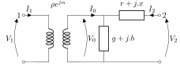

The `com.powsybl.iidm.network.TwoWindingsTransformer` interface is used to model a two windings power transformer.
A two windings power transformer is connected to two voltage levels (side 1 and side 2) that belong to a same substation.
A [ratio tap changer](./ratioTapChanger.md) and/or a [phase tap changer](./phaseTapChanger.md) can be associated to a two windings power transformer.

# Characteristics

| Attribute | Type | Unit | Required | Default value | Description |
| --------- | ---- | ---- | -------- | ------------- | ----------- |
| id | string | - | yes | - | Unique identifier of the transformer |
| name | string | - | yes | - | Humanly readable name of the transformer |
| $$r_{nom}$$ | double | $$\Omega$$  | yes | - | The nominal series resistance at the side 2 of the transformer |
| $$x_{nom}$$ | double | $$\Omega$$ | yes | - | The nominal series reactance at the side 2 of the transformer |
| $$g_{nom}$$ | double | S | yes | - | The nominal magnetizing conductance at the side 2 of the transformer |
| $$b_{nom}$$ | double | S | yes | - | The nominal magnetizing susceptance at the side 2 of the transformer |
| $$V_{1\ nom}$$ | double | kV | yes | - | The rated voltage at side 1 |
| $$V_{2\ nom}$$ | double | kV | yes | - | The rated voltage at side 2 |

Two windings transformers can also have [current limits](currentLimits.md) defined for each end.

# Model
Two windings transformer are modelled with the following equivalent $$\pi$$ model:

{: width="50%" .center-image}

With series impedance $$z$$ and the shunt admittance $$y$$ and $$\rho$$ the voltage ratio and $$\alpha$$ the angle difference, and parameters from current step of potential [ratio tap changer](./ratioTapChanger.md) and/or a [phase tap changer](./phaseTapChanger.md):

$$
r=r_{nom}.\left(1+\frac{r_{r, tap} + r_{\phi, tap}}{100}\right)\\
x=x_{nom}.\left(1+\frac{x_{r, tap} + x_{\phi, tap}}{100}\right)\\
g=g_{nom}.\left(1+\frac{g_{r, tap} + g_{\phi, tap}}{100}\right)\\
b=b_{nom}.\left(1+\frac{b_{r, tap} + b_{\phi, tap}}{100}\right)\\
\rho=\frac{V_{2nom}}{V_{1nom}}.\rho_{r, tap}.\rho_{\phi, tap}\\
\alpha=\alpha_{\phi, tap}\\
z=r+j.x\\
y=g+j.b\\
V_{0}=V_{1}.\rho e^{j\alpha}\\
I_{0}=\frac{I_{1}}{\rho e^{-j\alpha}}\\
$$

the equations of the two windings transformer, in complex notations, are as follow:

$$
\left(\begin{array}{c}
I_{1}\\
I_{2}
\end{array}\right)=\left(\begin{array}{cc}
\rho\text{²}(y+\frac{1}{z}) & -\rho e^{-j\alpha}\frac{1}{z}\\
-\rho e^{j\alpha}\frac{1}{z} & \frac{1}{z}
\end{array}\right)\left(\begin{array}{c}
V_{1}\\
V_{2}
\end{array}\right)
$$

# Examples
This example shows how to create a two windings transformer in the network:
```java
TwoWindingsTransformer twoWindingsTransformer = substation.newTwoWindingsTransformer()
    .setId("TWT2")
    .setName("My two windings transformer")
    .setVoltageLevel1("VL1")
    .setVoltageLevel2("VL2")
    .setNode1(1)
    .setNode2(2)
    .setR(0.5)
    .setX(4)
    .setG(0)
    .setB(0)
    .setRatedU1(24)
    .setRatedU2(385)
    .add();
```