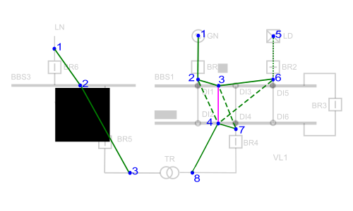

This example aims to create a substation with a node/breaker topology model and to visit it through the bus/breaker and the bus views. In a second time, we create the same substation with a bus/breaker topology model and we visit it through the bus/breaker and the bus views.

# Building a network in node/breaker topology model

The substation of this tutorial has two voltage levels VL1 and VL2 described with a node/breaker topology model. The first voltage level VL1 has 2 busbar sections BBS1 and BBS2, a generator GN, a load LD and a coupler BR3 between busbar section BBS1 and BBS2. The second voltage level VL2 has a single busbar section BBS3, a line LN and is connected to voltage level VL1 through transformer TR. Here is a diagram of the substation:

{: width="50%" .center-image}

The node/breaker topology model is stored inside the voltage level as a graph where connection nodes are the vertices and switches are the edges. The next diagram shows how to map the substation topology to a graph.

{: width="50%" .center-image}

- Each voltage level has its own topology graph. Voltage level VL1 has 8 connection nodes. Generator GN is connected to node 1, load LD to node 5, busbar sections BBS1 and BBS2 to node 3 and 4. 2, 6 and 7 are internal connection nodes.
- Voltage level VL2 has 3 nodes, line LN is connected to node 1, busbar section BBS3 to node 2.
- Transformer TR is connected to node 8 of voltage level 400 KV and node 3 of voltage level 225 KV.
- Plain edges represent closed switches.
- Dashed edges represent opened switches.
- Green edges will disappear during the bus/breaker topology computation whereas pink edges (like in this case 3<->4) will be retained whatever their position are (see [switches](switch.md)).

The code shows how to create the substation with a node/breaker topology model is fully implemented in the tutorial [topology](https://github.com/powsybl/powsybl-tutorials).

## Bus/breaker view

The following diagram shows computed bus/breaker topology. Compared to node/breaker topology, only remains equipements (GN, LD, TR, LN) and switches flagged as retained (BR3). Equipments are now connected through buses (B1 and B2).

{: width="50%" .center-image}

We can switch to a bus/breaker view on the substation voltage level VL1. VL1 contains 2 buses in the bus/breaker view. The first bus connects nodes 1, 2, 3, 5 and 6, and consequently generator GN and load LD. Note that load LD does not belong to the connected component. The second bus connects nodes 4, 7 and 8. Note that VL1 contains only 1 switch in the bus/breaker view (BR3). Here are the corresponding prints in the tutorial:

````
Bus: VL1_1
	 Generators: GN
Bus: VL1_4
	 T2W: TR
Bus: VL1_5
	 Loads: LD, connected component: null
Switch: BR3
Bus: VL2_1
	 T2W: TR
````

## Bus view

The following diagram shows the computed bus topology. Compared to bus/breaker topology, there is no switches anymore. Only remains equipements (GN, TR, LN) connected through buses. LD is not connected.

{: width="50%" .center-image}

We can switch to a bus view on substation voltage level VL1. VL1 contains 1 buses in the bus view. This bus connects all the equipements of voltage level VL1. Here are the corresponding prints in the tutorial:

````
Bus:VL1_1
	 Generators: GN
	 T2Ws: TR
Bus:VL2_1
	 T2Ws: TR
````

# Building a network in bus/breaker topology model

Note that creating a substation with a bus/breaker topology model is easier. Instead of creating VL1 and VL3 with a node/breaker topology model, we can directly create them in a simpler bus/breaker topology model. It can be very useful when data source only contains bus/branch data link in UCTE-DEF or in CIM-CGMES format sometimes. Warning: in that case the node/breaker view status on voltage level VL1 and VL2 is N/A. Here are the corresponding prints in the tutorial. Note that the load LD is not printed in that case:

````
bus/breaker network in bus/breaker view:
Bus: B1
	 Generators: GN
Bus: B2
	 T2Ws: TR
Switches: BR3
Bus: B3
	 T2Ws: TR
bus/breaker network in bus view:
Bus:VL1_0
	 Generators: GN
	 T2Ws: TR
Bus:VL2_0
	 T2Ws: TR
````
