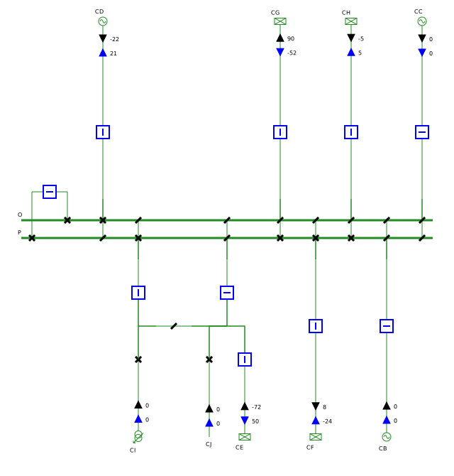
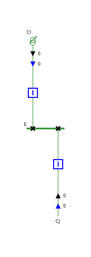

# Single Line Diagram - SVG Writing


We are showing in this guide how to create some single line diagrams, like the one above. 
We first generate such a diagram from a test network, then from a [CGMES](../../../grid/formats/cim-cgmes.md) file.
To that end, we use the `com.powsybl.sld.SingleLineDiagram` class, which is the central API of [powsybl-single-line-diagram](../../repositories/powsybl-single-line-diagram.md). 

## Prerequisites

### Maven dependencies
First of all, we need to add some Maven dependencies in our `pom.xml` file:

```xml
<dependencies>
    <dependency>
        <groupId>com.powsybl</groupId>
        <artifactId>powsybl-single-line-diagram-core</artifactId>
        <version>${powsybl.sld.version}</version>
    </dependency>
    <dependency>
        <groupId>com.powsybl</groupId>
        <artifactId>powsybl-iidm-impl</artifactId>
        <version>${powsybl.core.version}</version>
    </dependency>
    <dependency>
        <groupId>com.powsybl</groupId>
        <artifactId>powsybl-iidm-test</artifactId>
        <version>${powsybl.core.version}</version>
    </dependency>
    <dependency>
        <groupId>com.powsybl</groupId>
        <artifactId>powsybl-config-test</artifactId>
        <version>${powsybl.core.version}</version>
    </dependency>
    <dependency>
        <groupId>com.powsybl</groupId>
        <artifactId>powsybl-cgmes-conversion</artifactId>
        <version>${powsybl.core.version}</version>
    </dependency>
    <dependency>
        <groupId>com.powsybl</groupId>
        <artifactId>powsybl-triple-store-impl-rdf4j</artifactId>
        <version>${powsybl.core.version}</version>
    </dependency>
    <dependency>
        <groupId>org.slf4j</groupId>
        <artifactId>slf4j-simple</artifactId>
        <version>${slf4j.version}</version>
    </dependency>
</dependencies>

<properties>
    <powsybl.sld.version>3.0.0</powsybl.sld.version>
    <powsybl.core.version>5.0.0</powsybl.core.version>
    <slf4j.version>1.7.22</slf4j.version>
</properties>
```

Here are some details about these dependencies (see also the [powsybl artifacts documentation page](../../artifacts.md)):
- `powsybl-single-line-diagram-core` is the core module of single-line-diagram,
- `powsybl-iidm-impl` is for the network model,
- `powsybl-iidm-test` is for loading the test network,
- `powsybl-config-test` is for loading the test configuration (see [configuration API guide](../configuration.md)),
- `powsybl-cgmes-conversion` and `powsybl-triple-store-impl-rdf4j`  are for importing a CGMES file,
- `slf4j-simple` allows you to have simple logging capabilities.

## Diagrams from a test network
We first create the node/breaker test `Network` we are interested in:
```java
Network network = FictitiousSwitchFactory.create();
```

### Generating a voltage level diagram
We can generate the SVG diagram file for voltage level `N` with a single line of code:
```java
SingleLineDiagram.draw(network, "N", "/tmp/n.svg");
```

Note that we could also use a method specific for voltage levels: 

```java
SingleLineDiagram.drawVoltageLevel(network, "N", "/tmp/n.svg");
```

We obtain the following SVG:

{: width="70%" .center-image}

Similarly, we could generate a SVG for voltage level `C`:
 
```java
SingleLineDiagram.draw(network, "C", "/tmp/c.svg");
```
 
leading to the following diagram:

{: width="18%" .center-image}

### Generating the substation diagram
In order to build the diagram for the whole substation, named `A`, containing both voltage levels displayed previously, we may use the same interface:
```java
SingleLineDiagram.draw(network, "A", "/tmp/a.svg");
```

Similarly to before, there is also a method specific for substations which we could have used:
```java
SingleLineDiagram.drawSubstation(network, "A", "/tmp/a.svg");
```

In both cases, we obtain the following wider SVG file:

{: width="85%" .center-image}

## Diagrams from a CGMES file

First of all, we need to download sample files from ENTSO-E [here](https://github.com/powsybl/powsybl-cgmes-conformity-assessments/raw/main/src/test/resources/TestConfigurations_packageCASv2.0.zip)
(these files correspond to the test configurations for Conformity Assessment Scheme v2.0).
Inside the downloaded zip file, we will only consider the following file: 
`CGMES_v2.4.15_MicroGridTestConfiguration_T4_Assembled_NB_Complete_v2.zip`, which is contained in `MicroGrid/Type4_T4` folder. 

We first import this sample `Network` we are interested in:
```java
String file = "/path/to/file/MicroGrid/Type4_T4/CGMES_v2.4.15_MicroGridTestConfiguration_T4_Assembled_NB_Complete_v2.zip";
Network network = Importers.loadNetwork(file);
```

### Generating a voltage level diagram
Once the network is loaded, we can generate diagrams like in previous section.
We first generate a SVG for the voltage level named `110` in substation `PP_Brussels` (corresponding id is `_8bbd7e74-ae20-4dce-8780-c20f8e18c2e0`). 
Note that, as the ids are not very human-readable, we customize the parameters to have the names displayed instead of the ids.
Therefore, we use the slightly more complex interface `SingleLineDiagram.draw(network, id, path, parameters)`.

```java
// Use custom parameters to have the names displayed instead of the ids
LayoutParameters layoutParameters = new LayoutParameters().setUseName(true);

// Draw the diagram of voltage level 110 in substation PP_Brussels (id _8bbd7e74-ae20-4dce-8780-c20f8e18c2e0)
SingleLineDiagram.draw(network, "_8bbd7e74-ae20-4dce-8780-c20f8e18c2e0", Paths.get("/tmp/Brussels110.svg"), layoutParameters);
```

We obtain the following SVG:

{: width="40%" .center-image}

### Generating a substation diagram
Similarly to voltage level diagrams, we can generate substation diagrams. 
We generate the SVG diagram for the substation called `PP_Amsterdam`, which is containing four voltage levels. 
We customize a bit further the parameters: the feeder names in this substation are quite long, hence we rotate them to avoid overlapping.

```java
// Customize further the parameters to have the feeders label rotated, in order to avoid overlapping
layoutParameters.setLabelDiagonal(true);

// Draw the diagram of substation PP_Amsterdam (id _c49942d6-8b01-4b01-b5e8-f1180f84906c)
SingleLineDiagram.draw(network, "_c49942d6-8b01-4b01-b5e8-f1180f84906c", Paths.get("/tmp/AmsterdamSubstation.svg"), layoutParameters);
```

We then obtain the following SVG file representing the whole PP_Amsterdam substation with its three voltage levels:


That's it, you are now able to generate diagrams for substations and voltage levels! You can now try to change the default layout settings by reading the next guide [SVG Layouts]().

