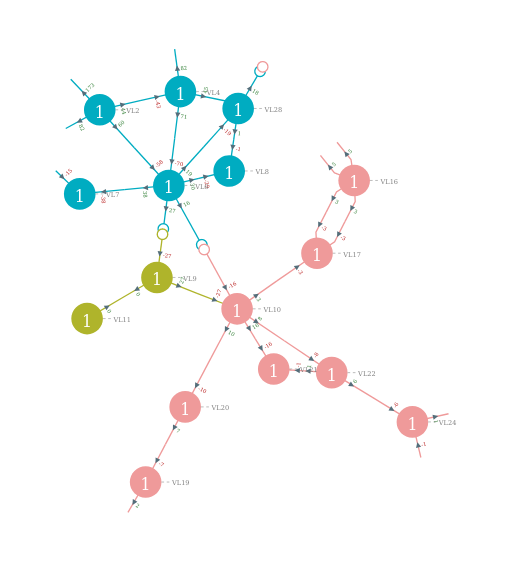

# powsybl-diagram 
The powsybl-diagram [repository](https://github.com/powsybl/powsybl-diagram) provides features to generate single-line diagrams and network graph diagrams.

## Features

### Generating a PowSyBl single-line diagram
The powsybl-single-line-diagram-core artifact provides features to generate customized single-line diagrams:
- Creation of single-line diagrams for given voltage levels, substations or zones in SVG format, for both node/breaker and bus/breaker topologies:
  - From an IIDM network: a graph is built from the input network and then written as a single-line diagram;
  - By directly providing the underlying graph to the writer.
- Diagram customization:
    - Several layout algorithms to generate the diagrams;
    - Many layout parameters to adjust the rendering;
    - Possible use of your own component library. Modification of the existing library is also an option;

Some extensions are also available. You may check the powsybl-single-line-diagram-cgmes-iidm-extensions artifact to force positions in the diagram for instance.

{: width="75%" .center-image}

With the 3.0.0 version, powsybl-single-line-diagram has been merged with powsybl-network-area-diagram into powsybl-diagram.

### Generating a PowSyBl network-area diagram
The powsybl-network-area-diagram artifact provides features to generate concise and customized diagrams of the network:
- Display of the graph whose nodes are the network voltage levels, and whose edges are the lines and transformers between those voltage levels;
- Generation of diagrams of the whole network or of part of the network, given a voltage level and a depth, or a list of voltage levels and a (unique) depth;
- Graph layout default implementation using a basic force layout algorithm, taken from [springy](https://github.com/dhotson/springy)
- Diagram customization:
    - Possible use of your own graph layout implementation;
    - Possible use of your own label provider to display custom directed values on the graph edges (default label provider displays the active power);
    - Possible use of your own style provider to have a custom style for nodes and edges (default style provider gives the nodes and edges a class corresponding to their voltage level and gives disconnected lines a specific class);
    - Possible use of your custom layout parameters and svg rendering parameters.

{: width="50%" .center-image}

With the 3.0.0 version, powsybl-network-area-diagram has been merged into powsybl-single-line-diagram to form powsybl-diagram.
Please have a look at the archived [powsybl-network-area-diagram](powsybl-network-area-diagram.md) page for further details on previous releases.

## Getting started

- [SVG Writing](../api_guide/svg-writing.md) - Create single-line diagrams and network-area diagrams from test networks;
- [SVG Tutorials](../tutorials/index.md) - Create simple or customized single-line diagrams;
- [SVG Layouts]() (*soon available*) - Change single-line diagram default layout.

## Releases

Please note that the 3.0.0 release is the first release since powsybl-network-area-diagram and powsybl-single-line diagram directories were merged into the powsybl-diagram repository.

| Version | Release date | Release notes                                                                                | API documentation                                                                           | [powsybl-dependencies](https://github.com/powsybl/powsybl-dependencies) version |
|---------|--------------|----------------------------------------------------------------------------------------------|---------------------------------------------------------------------------------------------|---------------------------------------------------------------------------------|
| 3.1.0   | 2023-02-01   | [Release notes](https://github.com/powsybl/powsybl-diagram/releases/tag/v3.1.0)              | [Javadoc](https://javadoc.io/doc/com.powsybl/powsybl-diagram/3.1.0/index.html)              | 2023.0.1                                                                        |
| 3.0.0   | 2022-11-18   | [Release notes](https://github.com/powsybl/powsybl-diagram/releases/tag/v3.0.0)              | [Javadoc](https://javadoc.io/doc/com.powsybl/powsybl-diagram/3.0.0/index.html)              | 2022.0.0                                                                        |
| 2.13.0  | 2022-09-16   | [Release notes](https://github.com/powsybl/powsybl-single-line-diagram/releases/tag/v2.13.0) | [Javadoc](https://javadoc.io/doc/com.powsybl/powsybl-single-line-diagram/2.13.0/index.html) | 1.3.0                                                                           |
| 2.12.0  | 2022-07-22   | [Release notes](https://github.com/powsybl/powsybl-single-line-diagram/releases/tag/v2.12.0) | [Javadoc](https://javadoc.io/doc/com.powsybl/powsybl-single-line-diagram/2.12.0/index.html) | 1.2.2                                                                           |
| 2.11.0  | 2022-06-14   | [Release notes](https://github.com/powsybl/powsybl-single-line-diagram/releases/tag/v2.11.0) | [Javadoc](https://javadoc.io/doc/com.powsybl/powsybl-single-line-diagram/2.11.0/index.html) | 1.2.0                                                                           |
| 2.10.0  | 2022-04-20   | [Release notes](https://github.com/powsybl/powsybl-single-line-diagram/releases/tag/v2.10.0) | [Javadoc](https://javadoc.io/doc/com.powsybl/powsybl-single-line-diagram/2.10.0/index.html) | 1.1.0                                                                           |
| 2.9.1   | 2022-03-22   | [Release notes](https://github.com/powsybl/powsybl-single-line-diagram/releases/tag/v2.9.1)  | [Javadoc](https://javadoc.io/doc/com.powsybl/powsybl-single-line-diagram/2.9.1/index.html)  | 1.0.0                                                                           |
| 2.9.0   | 2022-03-10   | [Release notes](https://github.com/powsybl/powsybl-single-line-diagram/releases/tag/v2.9.0)  | [Javadoc](https://javadoc.io/doc/com.powsybl/powsybl-single-line-diagram/2.9.0/index.html)  | -                                                                               |
| 2.8.0   | 2022-02-28   | [Release notes](https://github.com/powsybl/powsybl-single-line-diagram/releases/tag/v2.8.0)  | [Javadoc](https://javadoc.io/doc/com.powsybl/powsybl-single-line-diagram/2.8.0/index.html)  | -                                                                               |
| 2.7.0   | 2022-01-05   | [Release notes](https://github.com/powsybl/powsybl-single-line-diagram/releases/tag/v2.7.0)  | [Javadoc](https://javadoc.io/doc/com.powsybl/powsybl-single-line-diagram/2.7.0/index.html)  | -                                                                               |
| 2.6.0   | 2021-12-16   | [Release notes](https://github.com/powsybl/powsybl-single-line-diagram/releases/tag/v2.6.0)  | [Javadoc](https://javadoc.io/doc/com.powsybl/powsybl-single-line-diagram/2.6.0/index.html)  | -                                                                               |
| 2.5.1   | 2021-11-19   | [Release notes](https://github.com/powsybl/powsybl-single-line-diagram/releases/tag/v2.5.1)  | [Javadoc](https://javadoc.io/doc/com.powsybl/powsybl-single-line-diagram/2.5.1/index.html)  | -                                                                               |
| 2.5.0   | 2021-11-10   | [Release notes](https://github.com/powsybl/powsybl-single-line-diagram/releases/tag/v2.5.0)  | [Javadoc](https://javadoc.io/doc/com.powsybl/powsybl-single-line-diagram/2.5.0/index.html)  | -                                                                               |
| 2.4.0   | 2021-09-22   | [Release notes](https://github.com/powsybl/powsybl-single-line-diagram/releases/tag/v2.4.0)  | [Javadoc](https://javadoc.io/doc/com.powsybl/powsybl-single-line-diagram/2.4.0/index.html)  | -                                                                               |
| 2.3.0   | 2021-07-16   | [Release notes](https://github.com/powsybl/powsybl-single-line-diagram/releases/tag/v2.3.0)  | [Javadoc](https://javadoc.io/doc/com.powsybl/powsybl-single-line-diagram/2.3.0/index.html)  | -                                                                               |
| 2.2.0   | 2021-05-26   | [Release notes](https://github.com/powsybl/powsybl-single-line-diagram/releases/tag/v2.2.0)  | [Javadoc](https://javadoc.io/doc/com.powsybl/powsybl-single-line-diagram/2.2.0/index.html)  | -                                                                               |
| 2.1.0   | 2021-04-09   | [Release notes](https://github.com/powsybl/powsybl-single-line-diagram/releases/tag/v2.1.0)  | [Javadoc](https://javadoc.io/doc/com.powsybl/powsybl-single-line-diagram/2.1.0/index.html)  | -                                                                               |
| 2.0.0   | 2021-02-09   | [Release notes](https://github.com/powsybl/powsybl-single-line-diagram/releases/tag/v2.0.0)  | [Javadoc](https://javadoc.io/doc/com.powsybl/powsybl-single-line-diagram/2.0.0/index.html)  | -                                                                               |
| 1.9.1   | 2021-04-02   | [Release notes](https://github.com/powsybl/powsybl-single-line-diagram/releases/tag/v1.9.1)  | [Javadoc](https://javadoc.io/doc/com.powsybl/powsybl-single-line-diagram/1.9.1/index.html)  | -                                                                               |
| 1.9.0   | 2021-01-29   | [Release notes](https://github.com/powsybl/powsybl-single-line-diagram/releases/tag/v1.9.0)  | [Javadoc](https://javadoc.io/doc/com.powsybl/powsybl-single-line-diagram/1.9.0/index.html)  | -                                                                               |
| 1.8.0   | 2020-12-02   | [Release notes](https://github.com/powsybl/powsybl-single-line-diagram/releases/tag/v1.8.0)  | [Javadoc](https://javadoc.io/doc/com.powsybl/powsybl-single-line-diagram/1.8.0/index.html)  | -                                                                               |
| 1.7.1   | 2020-10-15   | [Release notes](https://github.com/powsybl/powsybl-single-line-diagram/releases/tag/v1.7.1)  | [Javadoc](https://javadoc.io/doc/com.powsybl/powsybl-single-line-diagram/1.7.1/index.html)  | -                                                                               |
| 1.7.0   | 2020-10-15   | [Release notes](https://github.com/powsybl/powsybl-single-line-diagram/releases/tag/v1.7.0)  | [Javadoc](https://javadoc.io/doc/com.powsybl/powsybl-single-line-diagram/1.7.0/index.html)  | -                                                                               |
| 1.6.0   | 2020-09-09   | [Release notes](https://github.com/powsybl/powsybl-single-line-diagram/releases/tag/v1.6.0)  | [Javadoc](https://javadoc.io/doc/com.powsybl/powsybl-single-line-diagram/1.6.0/index.html)  | -                                                                               |
| 1.5.0   | 2020-08-04   | [Release notes](https://github.com/powsybl/powsybl-single-line-diagram/releases/tag/v1.5.0)  | [Javadoc](https://javadoc.io/doc/com.powsybl/powsybl-single-line-diagram/1.5.0/index.html)  | -                                                                               |
| 1.4.0   | 2020-06-17   | [Release notes](https://github.com/powsybl/powsybl-single-line-diagram/releases/tag/v1.4.0)  | [Javadoc](https://javadoc.io/doc/com.powsybl/powsybl-single-line-diagram/1.4.0/index.html)  | -                                                                               |
| 1.3.0   | 2020-05-03   | [Release notes](https://github.com/powsybl/powsybl-single-line-diagram/releases/tag/v1.3.0)  | [Javadoc](https://javadoc.io/doc/com.powsybl/powsybl-single-line-diagram/1.3.0/index.html)  | -                                                                               |
| 1.2.0   | 2020-02-28   | [Release notes](https://github.com/powsybl/powsybl-single-line-diagram/releases/tag/v1.2.0)  | [Javadoc](https://javadoc.io/doc/com.powsybl/powsybl-single-line-diagram/1.2.0/index.html)  | -                                                                               |
| 1.1.0   | 2019-12-13   | [Release notes](https://github.com/powsybl/powsybl-single-line-diagram/releases/tag/v1.1.0)  | [Javadoc](https://javadoc.io/doc/com.powsybl/powsybl-single-line-diagram/1.1.0/index.html)  | -                                                                               |