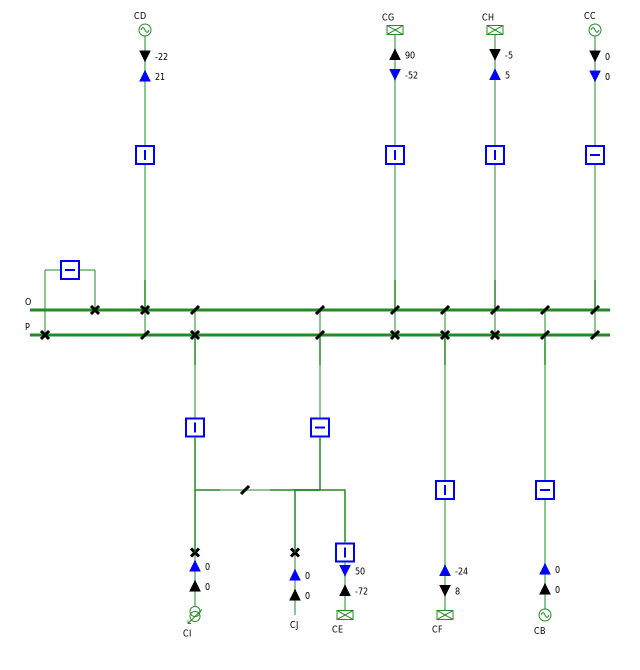
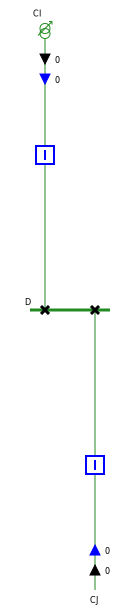
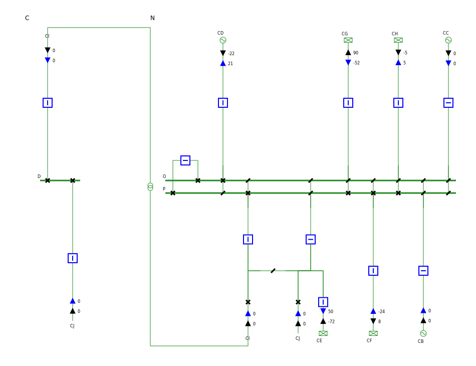

# Generating my first single line diagrams - Guide 1

In this guide we create a few single line diagrams of a test network with [powsybl-single-line-diagram](powsybl-single-line-diagram.md).


First of all, we need to add a Maven dependency for the Network model and three additional ones for this example: two for the `Network` test case, one for simple logging capabilities:

```xml
<dependency>
    <groupId>com.powsybl</groupId>
    <artifactId>powsybl-iidm-impl</artifactId>
    <version>3.7.1</version>
</dependency>
<dependency>
    <groupId>com.powsybl</groupId>
    <artifactId>powsybl-iidm-test</artifactId>
    <version>3.7.1</version>
</dependency>
<dependency>
    <groupId>com.powsybl</groupId>
    <artifactId>powsybl-config-test</artifactId>
    <version>3.7.1</version>
</dependency>
<dependency>
    <groupId>org.slf4j</groupId>
    <artifactId>slf4j-simple</artifactId>
    <version>1.7.22</version>
</dependency>
```

We can now load the node/breaker test `Network` we are interested in:
```java
Network network = FictitiousSwitchFactory.create();
```

In order to be able to generate the diagrams, we need to add the single line diagram core module dependency:
```xml
<dependency>
    <groupId>com.powsybl</groupId>
    <artifactId>powsybl-single-line-diagram-core</artifactId>
    <version>1.7.2</version>
</dependency>
```

Before generating diagrams we need to initialize a few layout parameters:

```java
// "Convergence" style component library
ComponentLibrary componentLibrary = new ResourcesComponentLibrary("/ConvergenceLibrary");

// fully automatic layout
VoltageLevelLayoutFactory voltageLevelLayoutFactory = new PositionVoltageLevelLayoutFactory(new PositionByClustering());

// create default parameters for the SVG layout
LayoutParameters layoutParameters = new LayoutParameters();
```

## Generating a voltage level diagram

We can now generate a SVG for voltage level "N":
```java
// create diagram for the voltage level "N"
VoltageLevelDiagram voltageLevelDiagram = VoltageLevelDiagram.build(new NetworkGraphBuilder(network), "N", voltageLevelLayoutFactory, false);

// generate SVG
voltageLevelDiagram.writeSvg("",
    new DefaultSVGWriter(componentLibrary, layoutParameters),
    new DefaultDiagramLabelProvider(network, componentLibrary, layoutParameters),
    new NominalVoltageDiagramStyleProvider(network),
    Paths.get("/tmp/n.svg"));
```

We obtain the following SVG:



Similarly, we could generate a SVG for voltage level "C":
 
```java
// create diagram for the voltage level "C"
VoltageLevelDiagram voltageLevelDiagram = VoltageLevelDiagram.build(new NetworkGraphBuilder(network), "N", voltageLevelLayoutFactory, false);

// generate SVG
voltageLevelDiagram.writeSvg("",
    new DefaultSVGWriter(componentLibrary, layoutParameters),
    new DefaultDiagramLabelProvider(network, componentLibrary, layoutParameters),
    new NominalVoltageDiagramStyleProvider(network),
    Paths.get("/tmp/c.svg"));
```
 
leading to the following SVG diagram:



## Generating a substation diagram
In order to build the diagram for the whole substation, named "A", containing both voltage levels displayed previously, we need to build the corresponding `SubstationDiagram`:
```java
// create diagram for the substation A
SubstationDiagram substationDiagram = SubstationDiagram.build(
    new NetworkGraphBuilder(network), "A", new HorizontalSubstationLayoutFactory(),
    voltageLevelLayoutFactory, false);

// generate SVG
substationDiagram.writeSvg("",
    new DefaultSVGWriter(componentLibrary, layoutParameters),
    Paths.get("/tmp/a.svg"),
    new DefaultDiagramLabelProvider(network, componentLibrary, layoutParameters),
    new NominalVoltageDiagramStyleProvider(network)
);
```

We then obtain the following wider svg file:


