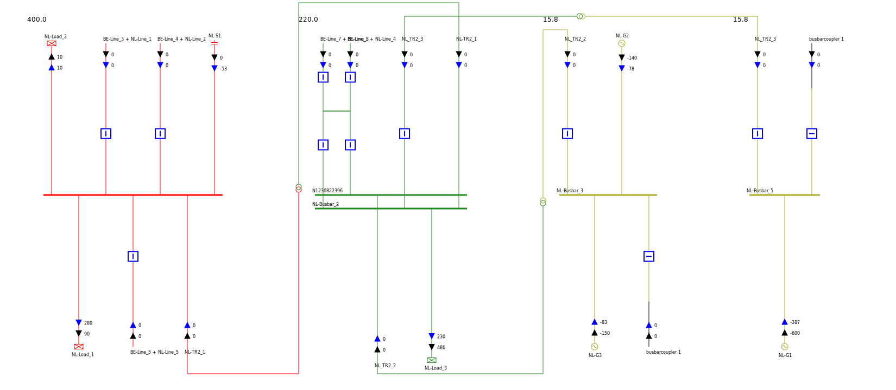

# Generating my first single line diagrams - Guide 2

In this guide we create a few single line diagrams of CGMES files with [powsybl-single-line-diagram](powsybl-single-line-diagram.md).

First of all, we need to download some CGMES sample files from ENTSO-E [here](https://docstore.entsoe.eu/Documents/CIM_documents/Grid_Model_CIM/TestConfigurations_packageCASv2.0.zip) (these files correspond to the test configurations for Conformity Assessment Scheme v2.0).

We will here display voltage levels and substations of following CGMES file CGMES_v2.4.15_MicroGridTestConfiguration_T4_Assembled_NB_Complete_v2.zip, contained in MicroGrid/Type4_T4 folder.

First we add a Maven dependency for the Network model, one additional dependency for simple logging capabilities and three for importing CGMES files:

```xml
<dependency>
    <groupId>com.powsybl</groupId>
    <artifactId>powsybl-iidm-impl</artifactId>
    <version>3.7.1</version>
</dependency>
<dependency>
    <groupId>org.slf4j</groupId>
    <artifactId>slf4j-simple</artifactId>
    <version>1.7.22</version>
</dependency>
<dependency>
    <groupId>com.powsybl</groupId>
    <artifactId>powsybl-config-test</artifactId>
    <version>3.7.1</version>
</dependency>
<dependency>
    <groupId>com.powsybl</groupId>
    <artifactId>powsybl-cgmes-conversion</artifactId>
    <version>3.7.1</version>
</dependency>
<dependency>
    <groupId>com.powsybl</groupId>
    <artifactId>powsybl-triple-store-impl-rdf4j</artifactId>
    <version>3.7.1</version>
</dependency>
```

We can now load the node/breaker test `Network` we are interested in:
```java
String file = "/path/to/file/MicroGrid/Type4_T4/CGMES_v2.4.15_MicroGridTestConfiguration_T4_Assembled_NB_Complete_v2.zip";
Network network = Importers.loadNetwork(Paths.get(file));
```

In order to be able to generate the diagrams, we need to add the single line diagram core module dependency:
```xml
<dependency>
    <groupId>com.powsybl</groupId>
    <artifactId>powsybl-single-line-diagram-core</artifactId>
    <version>1.7.2</version>
</dependency>
```

Before generating diagrams we need to initialize a few layout parameters:

```java
// "Convergence" style component library
ComponentLibrary componentLibrary = new ResourcesComponentLibrary("/ConvergenceLibrary");

// fully automatic layout
VoltageLevelLayoutFactory voltageLevelLayoutFactory = new PositionVoltageLevelLayoutFactory(new PositionByClustering());

// create default parameters for the SVG layout
LayoutParameters layoutParameters = new LayoutParameters();
```

## Generating a voltage level diagram

We can now generate a SVG for voltage level id "_8bbd7e74-ae20-4dce-8780-c20f8e18c2e0" (named "110" in substation "PP_Brussels"):
```java
// create diagram for the wanted voltage level
VoltageLevelDiagram voltageLevelDiagram = VoltageLevelDiagram.build(new NetworkGraphBuilder(network), "N", voltageLevelLayoutFactory, false);

// generate SVG
voltageLevelDiagram.writeSvg("",
    new DefaultSVGWriter(componentLibrary, layoutParameters),
    new DefaultDiagramLabelProvider(network, componentLibrary, layoutParameters),
    new NominalVoltageDiagramStyleProvider(network),
    Paths.get("/tmp/Brussels110.svg"));
```

We obtain the following SVG:


## Generating a substation diagram

Similarly to voltage level diagrams, we can generate substation diagrams. 
We generate the diagram for substation called "Amsterdam" (id "_c49942d6-8b01-4b01-b5e8-f1180f84906c"), which is containing four voltage levels. 
To that end we need to build the corresponding `SubstationDiagram`:

```java
// create diagram for the "Amsterdam" substation (id "_c49942d6-8b01-4b01-b5e8-f1180f84906c")
SubstationDiagram substationDiagram = SubstationDiagram.build(
    new NetworkGraphBuilder(network), "_c49942d6-8b01-4b01-b5e8-f1180f84906c", new HorizontalSubstationLayoutFactory(),
    voltageLevelLayoutFactory, false);

// generate SVG
substationDiagram.writeSvg("",
    new DefaultSVGWriter(componentLibrary, layoutParameters),
    Paths.get("/tmp/a.svg"),
    new DefaultDiagramLabelProvider(network, componentLibrary, layoutParameters),
    new NominalVoltageDiagramStyleProvider(network)
);
```

We then obtain the following SVG file representing the whole "Amsterdam" substation with its four voltage levels:


