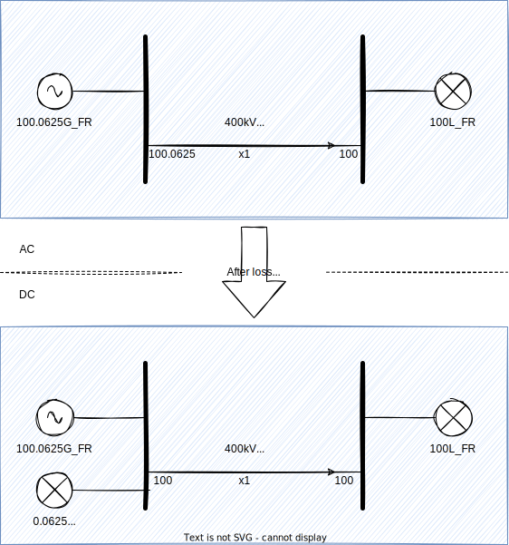
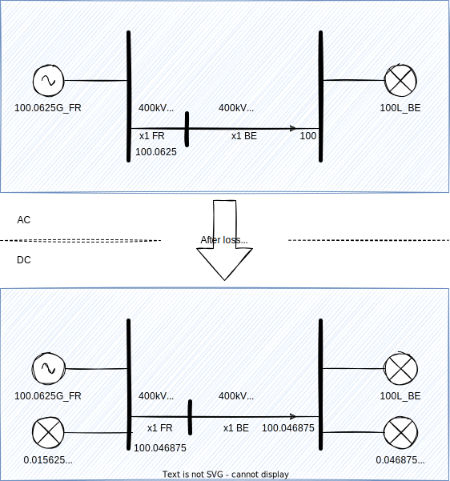

# Flow decomposition

* TOC
{:toc}

## Introduction

Flow decomposition methodology has been formerly described in a decision [published by ACER](https://eepublicdownloads.entsoe.eu/clean-documents/nc-tasks/CORE%20-%2074%20-%20ACER%20decision%20-%20Annex%201.pdf) (European Union Agency for the Cooperation of Energy Regulators).

European power system is based on zonal management. Flow decomposition is a tool designed to give insights on
impacts of internal and cross zonal exchange of power on the flows (and associated constraints) on the network devices.
It is an important part of the cost sharing methodolgy for remedial actions costs sharing between TSOs.

The aim of flow decomposition algorithm is to provide for each network element a decomposition of the active flow into different parts:
- Allocated flow: flow due to electricity market exchanges. This includes import/export flows and transit flows.
- Internal flow: flow due to electricity exchange inside the network element's zone.
- Loop flow: flow due to electricity exchange inside another zone.
- PST flow: flow due to a shift commanded by the action of an active phase shifting transformer on the network.
- Xnode flow: flow due to all unmerged interconnections and HVDC connections modelled as dangling lines in IIDM.

> This decomposition does not reflect the exact reality of how electric flows act on a real network, but it
> is a useful approximation needed for some cross zonal coordination processes.

## Algorithm description

The flow decomposition algorithm is based on the DC approximation, in which the losses in the network branches
are neglected, and that allows to rely on the superposition principle to assess which is the impact of any injection
on any branch flow by simple sensitivity analysis.

Below is the concrete description of the algorithm implemented in PowSyBl.

### Net positions computation

Countries' net position computation is done once for all on base case using AC loadflow in the initial network, before any other alteration of the input.

The net position of a country is calculated as the sum of the mean leaving flow of all AC and HVDC line interconnections
(losses are shared equally between both countries)

### Losses compensation

In order to mitigate the impact of DC approximation in the flow decomposition process, a dedicated step of losses compensation is implemented.

Instead of using standard power flow compensation methodology, a standard full AC power flow is run on the input network
that allows to calculate the losses on each network element.

These losses are then compensated on the sending side of each network element.

A special treatment is done on tie lines, where instead of compensating the losses on the sending terminal, losses are
compensated at both sides proportionally to the resistance of each half line.

### Nodal Injections partitioning

In order to distinguish internal/loop flows and allocated flows, the nodal injections in each zone must de decomposed in two parts:
- Nodal injections for allocated flows
- Nodal injections for loop flows and internal flows
- Nodal injections for xnode flows

This decomposition is based on GLSK (Generation and Load Shift Keys). It is an input of the process that provides,
for each zone of the study a list of injections and associated factor to be used to scale the zone to a given net position.

By default, the algorithm uses so-called "Country GSK", which is an automatic GLSK that scales on all generators
proportionally to their target power setpoint.

Nodal injection decomposition is done as follows:

$$
\begin{array}{l}
\mathrm{NI}_\mathrm{AF} = \mathrm{GLSK} \cdot \mathrm{NP} \\
\mathrm{NI}_\mathrm{LIF} = \mathrm{NI} - \mathrm{NI}_\mathrm{AF} - \mathrm{NI}_\mathrm{X}
\end{array}
$$

where:
- $$\mathrm{NI}$$ is the vector of the network injections,
- $$\mathrm{NI}_\mathrm{X}$$ is the vector of the network injections from dangling lines,
- $$\mathrm{NI}_\mathrm{AF}$$ is the vector of allocated flow part of the network injections, 
- $$\mathrm{NI}_\mathrm{LIF}$$ is the vector of loop flow and internal flow part of the network injections, 
- $$\mathrm{NP}$$ is the vector of the zones' net position, 
- $$\mathrm{GLSK}$$ is the matrix of the GLSK factors for each injection in each zone,

### Sensitivity analysis

In order to assess the linear impact (implied by the DC approximation) of each nodal injection and phase shift transformer
on the network elements' flow, a sensitivity analysis is run.

The following matrices are calculated using [sensitivity analysis](../sensitivity/index.md) API:
- $$\mathrm{PTDF}$$ is the matrix of the sensitivity of the network element flow to each network injection shift, 
- $$\mathrm{PSDF}$$ is the matrix of the sensitivity of the network element flow to each phase shift transformer tap angle change,

### Flow partitioning

Based on previously calculated elements, flow partitioning can now be calculated as follows:

$$
\begin{array}{l}
\mathrm{F}_\mathrm{AF} = \mathrm{PTDF} \cdot \mathrm{NI}_\mathrm{AF} \\
\mathrm{F}_\mathrm{LIF} = \mathrm{PTDF} \cdot \mathrm{diag}(\mathrm{NI}_\mathrm{LIF}) \cdot \mathrm{AM} \\
\mathrm{F}_\mathrm{PST} = \mathrm{PSDF} \cdot \mathrm{\Delta}_\mathrm{PST} \\
\mathrm{F}_\mathrm{X} = \mathrm{PTDF} \cdot \mathrm{NI}_\mathrm{X} \\
\end{array}
$$

where:
- $$\mathrm{F}_\mathrm{AF}$$ is the vector of the network element allocated flow, 
- $$\mathrm{F}_\mathrm{LIF}$$ is the matrix of the network element loop flow or internal flow for each zone, 
- $$\mathrm{F}_\mathrm{PST}$$ is the vector of the network element PST (phase shift transformer) flow,
- $$\mathrm{F}_\mathrm{X}$$ is the vector of the network element xnode flow,
- $$\mathrm{AM}$$ is the allocation matrix, which associates each injection to its zone. $$\mathrm{AM}_{ij}$$ = 1 if node i is in zone j, 0 otherwise, 
- $$\mathrm{\Delta}_\mathrm{PST}$$ is the phase shift transformers angle vector,

### Flow parts rescaling

Due to superposition principle, the sum of all the flow parts calculated previously is equal to the flow that was
calculated by the DC power flow.

However, the flow reference is the one calculated using AC power flow which is different. The final step of the algorithm
is though to rescale the different flow parts in order to ensure that the sum of the parts is equal to the initially calculated AC flow.

The difference between reference AC flow and the sum of the parts of the decomposition is redispatched on the different
parts proportionally to their rectified linear unit ($$\mathrm{ReLU}(x) = \mathrm{max}(x, 0)$$).

## Flow decomposition inputs

### Network

The first input of the flow decomposition algorithm is a network. As this simulation uses [power flow](../powerflow/index.md)
simulations for losses compensation, this network should converge.

Any available source can be used as a valid input for flow decomposition (including UCTE, CGMES, XIIDM).

>Some limitations exist in the type of network devices handled in the algorithm :
>- Flows on three windings transformers or HVDCs cannot be decomposed
>- Three windings transformers and HVDC lines losses are not compensated in losses compensation step 
>- Flows generated by HVDC which are not modeled with unmerged xnodes are not separated from loop flows

### GLSK

The second input of the flow decomposition algorithm are the GLSK to be used for each zone.

Current implementation of the algorithm only allows automatic generation of Country GSK for each country of the network.

### Network elements

The third input of the flow decomposition algorithm are the network elements of interest which flow is to be decomposed
into the parts listed in introduction - called XNEC (cross-border relevant network element with contingency) in the flow
decomposition methodology.

Algorithm may handle different network elements in the decomposition for each network state (base case or per contingency).

Current implementation of the algorithm is based on a XnecProvider interface. This interface should provide XNECs in the 
base case. Basic implementations of this interface are available:
- Set of all branches.
- Set of branches selected by IDs.
- Set of all interconnections on the network (i.e. branches which have different country attribute in their source and destination substation).
- Set of all interconnections on the network with the addition of all branches that have a maximum zonal PTDF greater than 5%.

Post contingency network elements can only be given to the algorithm using selection by IDs.

## Flow decomposition outputs

### Network element parts

For each network element of interest, flow decomposition outputs contain the following elements:
- Reference flow : active power flow that is considered as the reference for the decomposition. It is actually equal
to the sum of all the flow parts calculated by the algorithm.
- Allocated flow : allocated flow part of the network element's flow.
- Internal flow : internal flow part of the network element's flow. It is calculated as the loop flow from the country
which network element is part of (interconnections are considered as part of no specific country, so will always have an internal flow to 0).
- Loop flows : map of the loop flow part of the network element's flow for each zone.
- PST flow : PST flow part of the network element's flow.
- Xnode flow : flow part due to all unmerged interconnections and HVDC connections modelled as dangling lines in IIDM.

### Flow sign conventions

On one hand, the reference flows are oriented from side 1 to side 2 of the associated IIDM branch. A positive reference flow implies
a flow from side 1 to side 2, while a negative one means a flow from side 2 to side 1.

On the other hand, all flow parts (allocated flow, internal flow, loop flows and PST flow) are oriented in the branch
flow convention. A positive flow part tends to increase the absolute flow on the branch (i.e. a burdening flow), while a
negative one tends to decrease the absolute flow on the branch (i.e. a relieving flow).

## Configuration

### Dedicated parameters

| Name                                    | Type    | Default value                               | Description                                                                                                                                                                                                                                                                                                                 |
|-----------------------------------------|---------|---------------------------------------------|-----------------------------------------------------------------------------------------------------------------------------------------------------------------------------------------------------------------------------------------------------------------------------------------------------------------------------|
| enable-losses-compensation              | boolean | false                                       | When set to true, adds losses compensation step of the algorithm. Otherwise, all losses will be compensated using chosen power flow compensation strategy.                                                                                                                                                                  |
| losses-compensation-epsilon             | double  | 1e-5                                        | Threshold used in losses compensation step of the algorihm. If actual losses are below the given threshold on a branch, no injection is created in the network to compensate these losses. Used to avoid creating too many injections in the network. May have an impact in overall algorithm performance and memory usage. |
| sensitivity-epsilon                     | double  | 1e-5                                        | Threshold used when filling PTDF and PSDF matrices. If a sensitivity is below the given threshold, it is set to zero. Used to keep sparse matrices in the algorithm. May have an impact in overall algorithm performance and memory usage.                                                                                  |
| rescale-enabled                         | boolean | false                                       | When set to true, rescaling step is done to ensure that the sum of all flow parts is equal to the AC reference flow.                                                                                                                                                                                                        |
| dc-fallback-enabled-after-ac-divergence | boolean | true                                        | Defines the fallback behavior after an AC divergence Use True to run DC loadflow if an AC loadflow diverges (default). Use False to throw an exception if an AC loadflow diverges.                                                                                                                                          |
| sensitivity-variable-batch-size         | int     | 15000                                       | When set to a lower value, this parameter will reduce memory usage, but it might increase computation time                                                                                                                                                                                                                  |

### Impact of existing parameters

Any implementation of load flow provider and sensitivity analysis provider can be used, as the entire algorithm only
relies on common loadflow API and sensitivity analysis API.

Thus, flow decomposition algorithm relies on [load flow parameters](../powerflow/index.md) and [sensitivity analysis parameters](../sensitivity/index.md).

## Flow decomposition computation detailed results

It is possible to get intermediate detailed results of a flow decomposition computation by attaching observers to the FlowDecompositionComputer.
Observers are notified of the following events:
* when the computation starts
* when the base case starts to be computed
* when a contingency computation starts 
* when Glsk are computed
* when net positions are computed (for base case computation)
* when the nodal injection matrix is computed (for base case or contingency)
* when the PTDF matrix is computed (for base case or contingency)
* when the PSDF matrix is computed (for base case or contingency)
* when the AC nodal injections matrix is computed (for base case or contingency)
* when the DC nodal injections matrix is computed (for base case or contingency)
* when the AC loadflow is computed (for base case or contingency)
* when the DC loadflow is computed (for base case or contingency)
* when the computation is done

Note that these observers are meant to be used for testing purposes only.
Using observers impacts calculation performance and therefore are not suitable in production environment.
