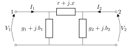

# OpenLoadFlow

PowSyBl OpenLoadFlow is an open-source power flow implementation in Java provided by PowSyBl. The source code is hosted on [GitHub](https://github.com/powsybl/powsybl-open-loadflow). 

* TOC
{:toc}

## Grid modelling

OpenLoadFlow computes power flows from IIDM grid model in bus/view topology. From the view, a very simple network, composed of only buses and branches is created. In the graph vision, we rely on a $$\Pi$$ model for branches (lines, transformers, dangling lines, etc.):

- $$R$$ and $$X$$ are respectively the real part (resistance) and the imaginary part (reactance) of the complex impedance ;  
- $$G_1$$ and $$G_2$$ are the real parts (conductance) on respectively side 1 and side 2 of the branch ;
- $$B_1$$ and $$B_2$$ are the imaginary parts (susceptance) on respectively side 1 and side 2 of the branch ;
- $$A_1$$ is the angle shifting on side 1, before the series impedance. For classical branches, the default value is zero ;
- $$\rho_1$$ is the ratio of voltages between side 2 and side 1, before the series impedance. For classical branches, the default value is $$1$$.

As the $$\Pi$$ model is created from IIDM grid modelling that locates its ratio and phase tap changers in side 1, $$A_2$$ and $$\rho_2$$ are always equal to zero and $$1$$. In case of a branch with voltage or phase control, the $$\Pi$$ model becomes an array. See below our model:

{: width="50%" .center-image}

### AC flows computing

AC flows computing in OpenLoadFLow relies on solving a system of non-linear squared equations, where unknown are voltage magnitude and phase angle at each bus of the network, implying that there are $$2N$$ unknown where $$N$$ is the number of buses. There are two equations per network bus, resulting in $$2N$$ equations. The nature of these $$2$$ equations depends on the type of the bus:
- PQ-bus: active and reactive balance are fixed at the bus,
- PV-bus: active balance and voltage magnitude are fixed at the bus.

Moreover, at the slack bus, the active balance equation is removed and replaced by an equation fixing the voltage phase angle at 0.

Let $$v_i$$ be the unknown voltage magnitude at bus $$i$$. Let $$\theta_i$$ be the unknown voltage phase angle at bus $$i$$. Equation fixing voltage magnitude to a reference (also called target) is simply written $$v_i = V^{ref}_i$$. Equation fixing voltage phase angle at slack bus $$i$$ is: $$\phi_i = 0$$

To build the active and reactive balance equations, OpenLoadFlow first expresses active and reactive power flowing from a bus to another through a line:

$$p_{i,j}= \rho_iv_i(G_i\rho_iv_i + Y\rho_iv_i\text{sin}(\Xi) - Y\rho_jv_j\text{sin}(\theta))$$

$$q_{i,j}= \rho_iv_i(-B_i\rho_iv_i + Y\rho_iv_i\text{cos}(\Xi) - Y\rho_jv_j\text{cos}(\theta))$$

Where $$Y$$ is the magnitude of the line complex admittance $$\frac{1}{R+jX}$$, and $$\Xi$$ such that: $$R+jX = \frac{1}{Y}e^{j(\frac{\pi}{2}-\Xi)}$$. $$\theta$$ satisfies: $$\theta= \Xi - A_i + A_j - \phi_i + \phi_j.$$

Beware that $$p_{i,j}$$ is the power that goes out from the bus $$i$$.

Therefore, active and reactive balance equations are expressed as:

$$ P_i^{in} = \sum_{j \in \delta(i)} p_{i,j}$$

$$ Q_i^{in} = \sum_{j \in \delta(i)} q_{i,j}$$

where $$\delta(i)$$ is the set of buses linked to $$i$$ in the network graph.

The resulting non-linear system of equations is solved via the Newton-Raphson algorithm.
The underlying principle of the algorithm is the following:
- It starts at a certain point $$x_0 = (v_0, \phi_0)$$ as an approximate solution to the system of equations;
- Then, in an iterative fashion, it generates a series $$x_1, x_2,.., x_k$$ of better approximate solutions to the system of equations;
- These iterates $$x_k$$ are found by solving a system of equations using local Jacobian matrix $$J(v,\phi)$$ at the previous point $$x_{k-1}$$; 

See **acSolverType** below for more details.

#### Other regulation modes

PQ-bus and PV-bus are used to model local voltage magnitude or local reactive power controls. Other controls are supported in OpenLoadFLow:
- Remote voltage control for generators, static var compensators and two and three windings transformers with ratio tap changer. Control shared over several controllers buses is supported ;
- Remote reactive power control for generators ;
- For static var compensator with a voltage set point, the support of a voltage per reactive power control, also called slope, that modifies a bit the local voltage at connection bus. We only support a local control. 

##### Remote voltage control

In our explanation, we have two buses. A generator or more is connected to bus $$b_1$$, that is called controller bus. The remote bus $$b_2$$, where voltage should reach the target, is called controlled bus. The bus $$b_1$$ is no longer a PQ-bus and becomes a P-bus: only active power balance is fixed for that bus. Bus $$b_2$$ becomes a PQV-bus, where the voltage magnitude is fixed at the value defined by the voltage control. To resume:
- At controller bus $$b_1$$:
    - $$P_{b_1}^{in} = \sum_{j \in v(b_1)} p_{b_1,j}$$.
- At controlled bus $$b_2$$:
    - $$P_{b_2}^{in} = \sum_{j \in v(b_2)} p_{b_2,j}$$.
    - $$Q_{b_2}^{in} = \sum_{j \in v(b_2)} q_{b_2,j}$$.
    - $$v_{b_2} = V^{c}_{b_1}$$.
    
##### Remote reactive power control

A bus $$b_1$$ has, through a generator, a remote reactive power control on a branch $$(i,j)$$. This controller bus is treated as a P-bus: only active power balance is fixed for that bus. The reactive power flowing at side i on line $$(i,j)$$ is fixed by the control (it could be at side j too). To resume:
- At controller bus $$b_1$$:
    - $$P_{b_1}^{in} = \sum_{j \in v(b_1)} p_{b_1,j}$$.
- At controlled branch $$(i,j)$$:
    - $$q_{i,j} = Q^{c}_{b_1}$$.
    
##### Local voltage control for a static var compensator with a slope 

We only support the simple case where:
- Only one generator controlling voltage is connected to a bus. If other generators are present, they should have a local reactive power control ;
- The control is local ;
- No other generators from other controller buses are controlling the bus where the static var compensator is connected. Let's call it $$b_1$$.

In that case only, the voltage equation at bus $$b_1$$ is replaced with:

$$v_{b_1} + s \cdot q_{svc} = V^{c}_{b_1}$$

Where $$s$$ is the slope of the static var compensator.

### DC flows computing

The DC flows computing relies on several classical assumptions to build a model where the active power flowing through a line depends linearly on the voltage angles at its ends.
In this simple model, reactive power flows and active power losses are totally neglected. The following assumptions are made to ease and speed the computations:
- The voltage magnitude is equal to $$1 per unit$$ at each bus,
- The series conductance $$G_{i,j}$$ of each line $$(i,j)$$ is neglected, only the series susceptance $$B_{i,j}$$ is considered,
- The voltage angle difference between two adjacent buses is considered as very small.

Therefore, the power flows from bus $$i$$ to bus $$j$$ following the linear expression:

$$ P_{i,j} = \frac{\theta_i-\theta_j+A_{i,j}}{X_{i,j}} $$

Where $$X_{i,j}$$ is the serial reactance of the line $$(i,j)$$, $$\theta_i$$ the voltage angle at bus $$i$$ and $$A_{i,j}$$ is the phase angle shifting on side $$j$$.

DC flows computing gives a linear grid constraints system.
The variables of the system are, for each bus, the voltage angle $$\theta$$.
The constraints of the system are the active power balance at each bus, except for the slack bus.
The voltage angle at slack bus is set to zero.
Therefore, the linear system is composed of $$N$$ variables and $$N$$ constraints, where $$N$$ is the number of buses in the network.

We introduce the linear matrix $$J$$ of this system that satisfies:

$$
\begin{align}
\texttt{If}~i~\text{is the slack bus}:&\\
&J_{i,i} = 1\\
\texttt{Else}:&\\
&J_{i,i} = \sum_{j \in \delta(i)} \frac{1}{X_{i,j}},\\
&J_{i,j} = - \frac{1}{X_{i,j}}, \quad \forall j \in \delta(i),\\
&\text{where}~\delta(i)~\text{is the set of buses linked to bus}~i~\text{in the network graph}\\
\text{All other entries of}~J~\text{are zero}.&
\end{align}
$$

The right-hand-side $$b$$ of the system satisfied:

$$
\begin{align}
\texttt{If}~i~\text{is the slack bus}:&\\
&b_{i} = 0\\
\texttt{Else}:&\\
&b_{i} = P_i - \sum_{j \in \delta(i)} \frac{A_{i,j}}{X_{i,j}},\\
&\text{where}~\delta(i)~\text{is the set of buses linked to bus}~i~\text{in the network graph}\\
\end{align}
$$

Where $$P_i$$ is the injection at bus $$i$$.

This linear system is resumed by:
$$ J\theta = b $$
The grid constraints system takes as variables the voltage angles.
Note that the vector $$b$$ of right-hand sides is linearly computed from the given injections and phase-shifting angles.

To solve this system, we follow the classic approach of the LU matrices decomposition $$ J = LU $$.
Hence, by solving the system using LU decomposition, you can compute the voltage angles by giving as data the injections and the phase-shifting angles.

## Configuration
To use PowSyBl OpenLoadFlow for all power flow computations, you have to configure the `load-flow` module in your configuration file:
```yaml
load-flow:
  default-impl-name: "OpenLoadFlow"
```

### Specific parameters

**voltageInitModeOverride**  
Additional voltage init modes of PowSyBl OpenLoadFlow that are not present in [PowSyBl LoadFlow `voltageInitMode` Parameter](index.md#available-parameters):
- `NONE`: no override
- `VOLTAGE_MAGNITUDE`: specific initializer to initialize voltages magnitudes $$v$$, leaving $$\theta=0$$. Proven useful for
unusual input data with transformers rated voltages very far away from bus nominal voltages.
- `FULL_VOLTAGE`: voltages magnitudes $$v$$ initialized using `VOLTAGE_MAGNITUDE` initializer, $$\theta$$ initialized using a DC load flow.

The default value is `NONE`.

**lowImpedanceBranchMode**  
The `lowImpedanceBranchMode` property is an optional property that defines how to deal with low impedance branches
(when $$Z$$ is less than the per-unit `lowImpedanceThreshold`, see further below).
Possible values are:
- Use `REPLACE_BY_ZERO_IMPEDANCE_LINE` if you want to consider low impedance branches as zero impedance branches.
- Use `REPLACE_BY_MIN_IMPEDANCE_LINE` if you want to consider low impedance branches with a value equal to the `lowImpedanceThreshold`.

The default value is `REPLACE_BY_ZERO_IMPEDANCE_LINE`.

**lowImpedanceThreshold**  
The `lowImpedanceThreshold` property is an optional property that defines in per-unit the threshold used to identify low impedance branches
(when $$Z$$ is less than the `lowImpedanceThreshold` per-unit threshold).  
The default value is $$10^{-8}$$ and it must be greater than `0`.

**slackDistributionFailureBehavior**
This option defines the behavior in case the slack distribution fails. Available options are:
- `THROW` if you want an exception to be thrown in case of failure
- `FAIL` if you want the OuterLoopStatus to be `FAILED` in case of failure
- `LEAVE_ON_SLACK_BUS` if you want to leave the remaining slack on the slack bus
- `DISTRIBUTE_ON_REFERENCE_GENERATOR` if you want to put the slack on the reference generator, disregarding active power limits. 
There must be a reference generator defined, i.e. `referenceBusSelectionMode` must be `GENERATOR_REFERENCE_PRIORITY` - otherwise this mode falls back to `FAIL` mode automatically.

The default value is `LEAVE_ON_SLACK_BUS`.

**slackBusSelectionMode**  
The `slackBusSelectionMode` property is an optional property that defines how to select the slack bus. The three options are available through the configuration file:
- `FIRST` if you want to choose the first bus of all the network buses.
- `NAME` if you want to choose a specific bus as the slack bus. In that case, the `slackBusesIds` property has to be filled.
- `MOST_MESHED` if you want to choose the most meshed bus among buses with the highest nominal voltage as the slack bus.
This option is typically required for computation with several synchronous components.
- `LARGEST_GENERATOR` if you want to choose the bus with the highest total generation capacity as the slack bus.

The default value is `MOST_MESHED`.

Note that if you want to choose the slack buses that are defined inside the network with
a [slack terminal extension](../../grid/model/extensions.md#slack-terminal),
you have to set the [PowSyBl LoadFlow `readSlackBus` Parameter](index.md#available-parameters) to `true`.
When `readSlackBus` is set to true, `slackBusSelectionMode` is still used and serves as a secondary selection criteria:
- for e.g. synchronous components where no slack terminal extension is present.
- for e.g. synchronous components where more than `maxSlackBusCount` slack terminal extensions are present.

**mostMeshedSlackBusSelectorMaxNominalVoltagePercentile**
This option is used when `slackBusSelectionMode` is set to `MOST_MESHED`. It sets the maximum nominal voltage percentile.
The default value is `95` and it must be inside the interval [`0`, `100`].

**maxSlackBusCount**  
Number of slack buses to be selected. Setting a value above 1 can help convergence on very large networks with large initial imbalances,
where it might be difficult to find a single slack with sufficient branches connected and able to absorb or evacuate the slack power.  
The default value is `1`.

**slackBusesIds**  
The `slackBusesIds` property is a required property if you choose `NAME` for property `slackBusSelectionMode`.
It defines a prioritized list of buses or voltage levels to be chosen for slack bus selection (as an array, or as a comma or semicolon separated string).

**slackBusCountryFilter**  
The `slackBusCountryFilter` defines a list of countries where slack bus should be selected (as an array, or as a comma or semicolon separated string).  
Countries are specified by their alpha 2 code (e.g. `FR`, `BE`, `DE`, ...).  
The default value is an empty list (any country can be used for slack bus selection).

**loadPowerFactorConstant**  
The `loadPowerFactorConstant ` property is an optional boolean property. This property is used in the outer loop that distributes slack on loads if :
- `distributedSlack` property is set to true in the [load flow default parameters](index.md#available-parameters),
- `balanceType` property is set to `PROPORTIONAL_TO_LOAD` or `PROPORTIONAL_TO_CONFORM_LOAD` in the [load flow default parameters](index.md#available-parameters).

The default value is `false`.

If prerequisites fulfilled and `loadPowerFactorConstant` property is set to `true`, the distributed slack outer loop adjusts the load P value and adjusts also the load Q value in order to maintain the power factor as a constant value.
At the end of the load flow calculation, $$P$$ and $$Q$$ at loads terminals are both updated. Note that the power factor of a load is given by this equation :

$$
Power Factor = {\frac {P} {\sqrt {P^2+{Q^2}}}}
$$ 

Maintaining the power factor constant from an updated active power $$P^‎\prime$$ means we have to isolate $$Q^‎\prime$$ in this equation :

> $$
{\frac {P} {\sqrt {P^2+{Q^2}}}}={\frac {P^‎\prime} {\sqrt {P^‎\prime^2+{Q^‎\prime^2}}}}
$$

> Finally, a simple rule of three is implemented in the outer loop :

> $$
Q^\prime={\frac {Q P^\prime} {P}}
$$

If `balanceType` equals to `PROPORTIONAL_TO_LOAD`, the power factor remains constant scaling the global $$P0$$ and $$Q0$$ of the load.
If `balanceType` equals to `PROPORTIONAL_TO_CONFORM_LOAD`, the power factor remains constant scaling only the variable parts. Thus, we fully rely on [load detail extension](../../grid/model/extensions.md#load-detail).

The default value for `loadPowerFactorConstant` property is `false`.

**slackBusPMaxMismatch**  
When slack distribution is enabled (`distributedSlack` set to `true` in LoadFlowParameters), this is the threshold below which slack power
is considered to be distributed.  
The default value is `1 MW` and it must be greater or equal to `0 MW`.

**voltageRemoteControl**  
The `voltageRemoteControl` property is an optional property that defines if the remote control for voltage controllers has to be modeled.
If set to false, any existing voltage remote control is converted to a local control, rescaling the target voltage
according to the nominal voltage ratio between the remote regulated bus and the equipment terminal bus.  
The default value is `true`.

**voltagePerReactivePowerControl**  
Whether simulation of static VAR compensators with voltage control enabled and a slope defined should be enabled
(See [voltage per reactive power control extension](../../grid/model/extensions.md#voltage-per-reactive-power-control)).  
The default value is `false`.

**generatorReactivePowerRemoteControl**  
Whether simulation of generators reactive power remote control should be enabled
(See [remote reactive power control](../../grid/model/extensions.md#remote-reactive-power-control)).  
The default value is `false`.

**secondaryVoltageControl**  
Whether simulation of secondary voltage control should be enabled.  
The default value is `false`.

**reactiveLimitsMaxPqPvSwitch**  
When `useReactiveLimits` is set to `true`, this parameter is used to limit the number of times an equipment performing voltage control
is switching from PQ to PV type. After this number of PQ/PV type switch, the equipment will not change PV/PQ type anymore.  
The default value is `3` and it must be greater or equal to `0`.

**phaseShifterControlMode**
- `CONTINUOUS_WITH_DISCRETISATION`: phase shifter control is solved by the Newton-Raphson inner-loop.
- `INCREMENTAL`: phase shifter control is solved in the outer-loop

The default value is `CONTINUOUS_WITH_DISCRETISATION`.

**transformerVoltageControlMode**  
This parameter defines which kind of outer loops is used for transformer voltage controls. We have three kinds of outer loops:  
- `WITH_GENERATOR_VOLTAGE_CONTROL` means that a continuous voltage control is performed in the same time as the generator voltage control. The final transformer $$\rho$$ is obtained by rounding to the closest tap position. The control deadband is not taken into account.
- `AFTER_GENERATOR_VOLTAGE_CONTROL` means that a continuous voltage control is performed after the generator voltage control. The final transformer $$\rho$$ is obtained by rounding to the closest tap position. The control deadband is taken into account.
- `INCREMENTAL_VOLTAGE_CONTROL` means that an incremental voltage control is used. $$\rho$$ always corresponds to a tap position. Tap changes using sensitivity computations. The control deadband is taken into account.

The default value is `WITH_GENERATOR_VOLTAGE_CONTROL`.

**transformerReactivePowerControl**
This parameter enables the reactive power control of transformer through a dedicated incremental reactive power control outer loop. The default value is `false`.

**incrementalTransformerRatioTapControlOuterLoopMaxTapShift**  
Maximum number of tap position change during a single iteration of the incremental voltage and or reactive power control outer loop.
Applies when `transformerVoltageControlMode` is set to `INCREMENTAL_VOLTAGE_CONTROL` and or when `transformerReactivePowerControl` is enabled (`true`). The default value is `3`.

**shuntVoltageControlMode**  
This parameter defines which kind of outer loops is used for the shunt voltage control. We have two kinds of outer loops: 
- `WITH_GENERATOR_VOLTAGE_CONTROL` means that a continuous voltage control is performed in the same time as the generator voltage control. Susceptance is finally rounded to the closest section for shunt that are controlling voltage. The control deadband is not taken into account.
- `INCREMENTAL_VOLTAGE_CONTROL` means that an incremental voltage control is used. Susceptance always corresponds to a section. Section changes using sensitivity computations. The control deadband is taken into account.

The default value is `WITH_GENERATOR_VOLTAGE_CONTROL`.

**svcVoltageMonitoring**  
Whether simulation of static VAR compensators voltage monitoring should be enabled.  
The default value is `true`.

**acSolverType**  
AC load flow solver engine. Currently, it can be one of:
- `NEWTON_RAPHSON` is the standard Newton-Raphson algorithm for load flow. Solves linear systems via Sparse LU decomposition (by [SuiteSparse](https://people.engr.tamu.edu/davis/suitesparse.html));
- `NEWTON_KRYLOV` is also the standard Newton-Raphson algorithm for load flow. Solves linear systems via Krylov subspace methods for indefinite non-symmetric matrices (by [Kinsol](https://computing.llnl.gov/projects/sundials/kinsol)).

The default value is `NEWTON_RAPHSON`.

**maxOuterLoopIterations**  
Maximum number of iterations for Newton-Raphson outer loop.  
The default value is `20` and it must be greater or equal to `1`.

**newtonRaphsonStoppingCriteriaType**  
Stopping criteria for Newton-Raphson algorithm.
- `UNIFORM_CRITERIA`: stop when all equation mismatches are below `newtonRaphsonConvEpsPerEq` threshold.
  `newtonRaphsonConvEpsPerEq` defines the threshold for all equation types, in per-unit with `100 MVA` base. The default value is $$10^{-4} \text{p.u.}$$ and it must be greater than 0.
- `PER_EQUATION_TYPE_CRITERIA`: stop when equation mismatches are below equation type specific thresholds:
  - `maxActivePowerMismatch`: Defines the threshold for active power equations, in MW. The default value is $$10^{-2} \text{MW}$$ and it must be greater than 0.
  - `maxReactivePowerMismatch`: Defines the threshold for reactive power equations, in MVAr. The default value is $$10^{-2} \text{MVAr}$$ and it must be greater than 0.
  - `maxVoltageMismatch`: Defines the threshold for voltage equations, in per-unit. The default value is $$10^{-4} \text{p.u.}$$ and it must be greater than 0.
  - `maxAngleMismatch`: Defines the threshold for angle equations, in radians. The default value is $$10^{-5} \text{rad}$$ and it must be greater than 0.
  - `maxRatioMismatch`: Defines the threshold for ratio equations, unitless. The default value is $$10^{-5}$$ and it must be greater than 0.
  - `maxSusceptanceMismatch`: Defines the threshold for susceptance equations, in per-unit. The default value is $$10^{-4} \text{p.u.}$$ and it must be greater than 0.

The default value is `UNIFORM_CRITERIA`.

**maxNewtonRaphsonIterations**  
Only applies if **acSolverType** is `NEWTON_RAPHSON`.
Maximum number of iterations for Newton-Raphson inner loop.  
The default value is `15` and it must be greater or equal to `1`.

**maxNewtonKrylovIterations**  
Only applies if **acSolverType** is `NEWTON_KRYLOV`.
Maximum number of iterations for Newton-Raphson inner loop.
The default value is `100` and it must be greater or equal to `1`.

**stateVectorScalingMode**  
Only applies if **acSolverType** is `NEWTON_RAPHSON`.
This parameter 'slows down' the Newton-Raphson by scaling the state vector between iterations. Can help convergence in some cases.
- `NONE`: no scaling is made
- `LINE_SEARCH`: applies a line search strategy
- `MAX_VOLTAGE_CHANGE`: scale by limiting voltage updates to a maximum amplitude p.u. and a maximum angle.

The default value is `NONE`.

**lineSearchStateVectorScalingMaxIteration**  
Only applies if **acSolverType** is `NEWTON_RAPHSON` and if **stateVectorScalingMode** is `LINE_SEARCH`.  
Maximum iterations for a vector scaling when applying a line search strategy.  
The default value is `10` and it must be greater or equal to `1`.

**lineSearchStateVectorScalingStepFold**  
Only applies if **acSolverType** is `NEWTON_RAPHSON` and if **stateVectorScalingMode** is `LINE_SEARCH`.  
At the iteration $i$ of vector scaling with the line search strategy, with this parameter having the value $s$ , the step size will be $ \mu  = \frac{1}{s^i}$ .   
The default value is `4/3 = 1.333` and it must be greater than `1`.

**maxVoltageChangeStateVectorScalingMaxDv**  
Only applies if **acSolverType** is `NEWTON_RAPHSON` and if **stateVectorScalingMode** is `MAX_VOLTAGE_CHANGE`.  
Maximum amplitude p.u. for a voltage change.  
The default value is `0.1 p.u.` and it must be greater than `0`.

**maxVoltageChangeStateVectorScalingMaxDphi**  
Only applies if **acSolverType** is `NEWTON_RAPHSON` and if **stateVectorScalingMode** is `MAX_VOLTAGE_CHANGE`.  
Maximum angle for a voltage change.  
The default value is `0.174533 radians` (`10°`) and it must be greater than `0`.

**newtonKrylovLineSearch**  
Only applies if **acSolverType** is `NEWTON_KRYLOV`.
Activates or deactivates line search for the Newton-Raphson Kinsol solver.
The default value is `false`.

**plausibleActivePowerLimit**  
The `plausibleActivePowerLimit` property is an optional property that defines a maximal active power limit for generators to be considered as participating elements for:
- slack distribution (if `balanceType` equals to any of the `PROPORTIONAL_TO_GENERATION_<any>` types)
- slack selection (if `slackBusSelectionMode` equals to `LARGEST_GENERATOR`)

The default value is $$5000 MW$$.

**minPlausibleTargetVoltage** and **maxPlausibleTargetVoltage**  
Equipments with voltage regulation target voltage outside these per-unit thresholds
are considered suspect and are discarded from regulation prior to load flow resolution.  
The default values are `0.8` and `1.2` and they must be greater or equal to `0`.

**minRealisticVoltage** and **maxRealisticVoltage**  
These parameters are used to identify if Newton-Raphson has converged to an unrealistic state.
For any component where a bus voltage is solved outside these per-unit thresholds, the component solution is deemed unrealistic
and its solution status is flagged as failed.  
The default values are `0.5` and `1.5` and they must be greater or equal to `0`.

**reactiveRangeCheckMode**  
This parameter defines how to check the reactive limits $$MinQ$$ and $$MaxQ$$ of a generator. If the range is too small, the generator is discarded from voltage control.
- `MIN_MAX` mode checks if the reactive range at $$MaxP$$ is above a threshold and if the reactive range at $$MinP$$ is not zero.
- `MAX` mode if the reactive range at $$MaxP$$ is above a threshold.
- `TARGET_P` if the reactive range at $$TargetP$$ is above a threshold

The default value is `MAX`.

**reportedFeatures**  
This parameter allows to define a set of features which should generate additional reports (as an array, or as a comma or semicolon separated string).
In current version this parameter can be used to request Newton-Raphson iterations report:
- `NEWTON_RAPHSON_LOAD_FLOW`: report Newton-Raphson iteration log for load flow calculations.
- `NEWTON_RAPHSON_SECURITY_ANALYSIS`: report Newton-Raphson iteration log for security analysis calculations.
- `NEWTON_RAPHSON_SENSITIVITY_ANALYSIS`: report Newton-Raphson iteration log for sensitivity analysis calculations.

Newton-Raphson iterations report consist in reporting:
- the involved synchronous component
- the involved Newton-Raphson outer loop iteration
- for each Newton-Raphson inner loop iteration:
  - maximum active power mismatch, the related bus Id with current solved voltage magnitude and angle.
  - maximum reactive power mismatch, the related bus Id with current solved voltage magnitude and angle.
  - maximum voltage control mismatch, the related bus Id with current solved voltage magnitude and angle.
  - the norm of the mismatch vector

The default value is an empty set of features to report.

**networkCacheEnabled**  
This parameter is used to run fast simulations by applying incremental modifications on the network directly to the OpenLoadFlow internal modelling.
The cache mode allows faster runs when modifications on the network are light.
Not all modifications types are supported yet, currently supported modifications are:
- target voltage modification
- switch open/close status modification. The switches to be modified must be configured via the `actionableSwitchesIds` property (as an array, or as a comma or semicolon separated string).

The default value is `false`.

**actionableSwitchesIds**  
This parameter list is used if `networkCachedEnabled` is activated. It defines a list of switches that might be modified (as an array, or as a comma or semicolon separated string). When one of the switches changes its status (open/close) and a load flow is run just after, the cache will be used to a faster resolution. Note that in the implementation, all the switches of that list will be considered as retained, leading to a size increase of the Jacobian matrix. The list should have a reasonable size, otherwise the simulation without cache use should be preferred. 

**alwaysUpdateNetwork**  
Update the iIDM network state even in case of non-convergence.  
The default value is `false`.

**debugDir**  
Allows to dump debug files to a specific directory.  
The default value is undefined (`null`), disabling any debug files writing.

**asymmetrical**  
Allows to run asymmetrical calculations. The default value is `false`. 

**useActiveLimits**  
Allows to ignore active power limits during calculations. Active power limits are mainly involved in slack distribution on generators. The default value is `true`.

**disableVoltageControlOfGeneratorsOutsideActivePowerLimits**  
Disables voltage control for generators with `targetP` outside the interval [`minP`, `maxP`]. The default value is `false`.

**minNominalVoltageTargetVoltageCheck**  
This parameter defines the minimal nominal voltage to check the target of voltage control in per-unit.
The default value is `20 kV`, meaning that under the controlled buses of voltage levels under this value are ignored from the check.
It must be greater or equal to `0 kV`.

**reactivePowerDispatchMode**  
TODO
This parameter defines how reactive power is split among generators with controls (voltage or reactive power).
It tries to divide reactive power among generators in the order described below.
`reactivePowerDispatchMode` can be one of:
- `Q_EQUAL_PROPORTION` 
  1. If all concerned generators have pre-defined reactive keys via the [Coordinated Reactive Control extension](../../grid/model/extensions.md#coordinated-reactive-control), then it splits `Q` proportional to reactive keys
  2. If they don't, but they have plausible reactive limits, split proportionally to the maximum reactive power range
  3. If they don't, split `Q` equally 
- `K_EQUAL_PROPORTION` 
  1. If generators have plausible reactive limits, split `Q` proportionally to `k`, where `k` is defined by
  $$ k = \frac{2 qToDispatch - qmax1 - qmin1 - qmax2 - qmin2 - ...}{qmax1 - qmin1 + qmax2 - qmin2 + ...} $$
  2. If they don't, split `Q` equally

The default value is `Q_EQUAL_PROPORTION`.

**disableVoltageControlOfGeneratorsOutsideActivePowerLimits**  
This parameter allows to disable the voltage control of generators which `targetP` is lower than `minP` or greater than `maxP`. The default value is `false`.

**outerLoopNames**  
This parameter allows to configure both the list of outer loops that can be executed and their explicit execution order. 
Each outer loop name specified in the list must be unique and match the `NAME` attribute of the respective outer loop.

By default, this parameter is set to `null`, and the activated outer loops are executed in a default order (defined in DefaultAcOuterLoopConfig).

**linePerUnitMode**  
This parameter defines how lines ending in different nominal voltages at both sides are perunit-ed.
`linePerUnitMode` can be one of:
- `IMPEDANCE`: handle difference in nominal voltage via impedance correction
- `RATIO`: handle difference in nominal voltage by introducing a ratio

The default value is `IMPEDANCE`.

**useLoadModel**  
When set to `true`, this parameter enables the modeling of the `ZIP` or `EXPONENTIAL` response characteristic of a [Load](../../grid/model/#load).

**dcApproximationType**  
This parameter defines how resistance is neglected compared to inductance in DC approximation.
`dcApproximationType` can be one of:
- `IGNORE_R`: consider that r << x
- `IGNORE_G`: consider that g << b

The default value is `IGNORE_R`.

**simulateAutomationSystems**  
Allows to simulate automation systems that are modeled in the network. For the moment, the grid model only supports overload management systems. The default behaviour is `false`.

**referenceBusSelectionMode**  
The reference bus is the bus where the angle is equal to zero. There are several mode of selection:
- `FIRST_SLACK`: the angle reference bus is selected as the first slack bus among potentially multiple slacks (in case `maxSlackBusCount` > 1).
- `GENERATOR_REFERENCE_PRIORITY`: the angle reference bus is selected from generator reference priorities defined via the [Reference Priority extension](../../grid/model/extensions.md#reference-priority).

The default value is `FIRST_SLACK`.

**writeReferenceTerminals**  
This parameter allows to write to the IIDM network the [Reference Terminals extension](../../grid/model/extensions.md#reference-terminals)
containing the generator terminals used as angle reference in the load flow calculation.
There is one Terminal created/added in the extension for each calculated Synchronous Component.
Works only when `referenceBusSelectionMode` is set to `GENERATOR_REFERENCE_PRIORITY`.

### Configuration file example
See below an extract of a config file that could help:

```yaml
open-loadflow-default-parameters:
  lowImpedanceBranchMode: REPLACE_BY_ZERO_IMPEDANCE_LINE
  slackDistributionFailureBehavior: LEAVE_ON_SLACK_BUS
  voltageRemoteControl: false
  slackBusSelectionMode: NAME
  slackBusesIds: Bus3_0,Bus5_0
  loadPowerFactorConstant: true
```

At the moment, overriding the parameters by a JSON file is not supported by OpenLoadFlow.
