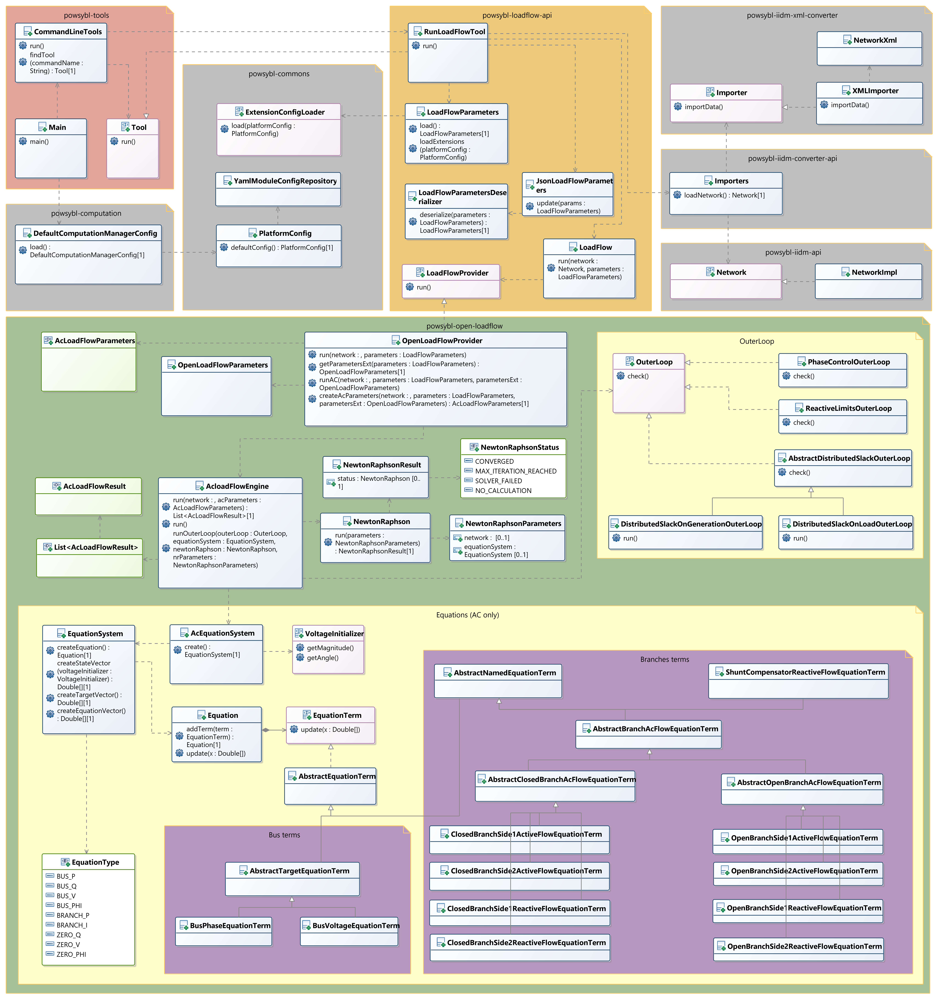

# Open Load Flow : functional specification with UML 

* TOC
{:toc}

## Purpose
Give a summary view about Open Load Flow and its integration with powsybl-tools.

## Bibliography
- [Introduction to electric power and energy systems](https://people.montefiore.uliege.be/vct/elec0014/elec0014.pdf)
- [Le calcul de repartition de charge (ou load flow)](https://people.montefiore.uliege.be/vct/elec0029/lf.pdf)
- [Web page of Thierry Van Cutsem](https://people.montefiore.uliege.be/vct/courses)

## Classes involved when running loadflow with itools

| Maven&nbsp;dependency&nbsp;&nbsp;&nbsp;&nbsp;&nbsp;&nbsp;&nbsp;&nbsp;&nbsp; | Usage |
| -------------------------- | - |
| powsybl-tools              | provide a main method to run a tool (**loadflow** in this documentation) |
| powsybl-computation        | load config file in **PlatformConfig** object, config file is provided with two VM parameters : **powsybl.config.dirs** and **powsybl.config.name** |
| powsybl-loadflow-api       | load network from given file defined by parameter **--case-file**. Then, init **LoadFlowParameters** with **PlatformConfig** previously loaded : call **ExtensionConfigLoader** implementation on each module, for example, specific configuration of **open-loadflow** module is loaded in **OpenLoadFlowConfigLoader** inner class |
| powsybl-iidm-converter-api | used to load **network** from **xiidm** file (xml format) |
| powsybl-open-loadflow      | this dependency is the one we discuss about in this documentation. Network simulation is run in this dependency. It builds an equation system before calling Newton-Raphson with a Jacobian Matrix. It adjusts network parameters and run again NewtonRaphson to improve result. At the end, it returns CONVERGED if |

{: width="100%" .center-image}

