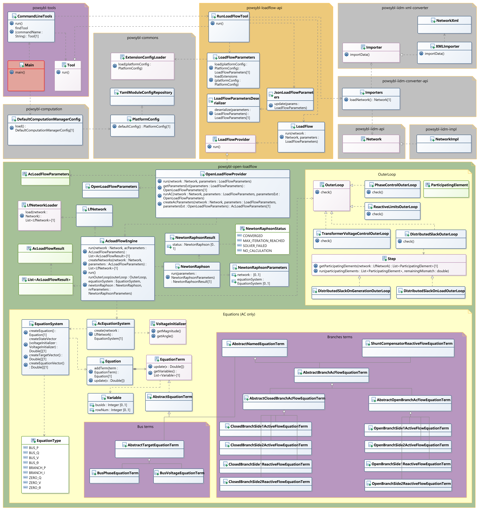
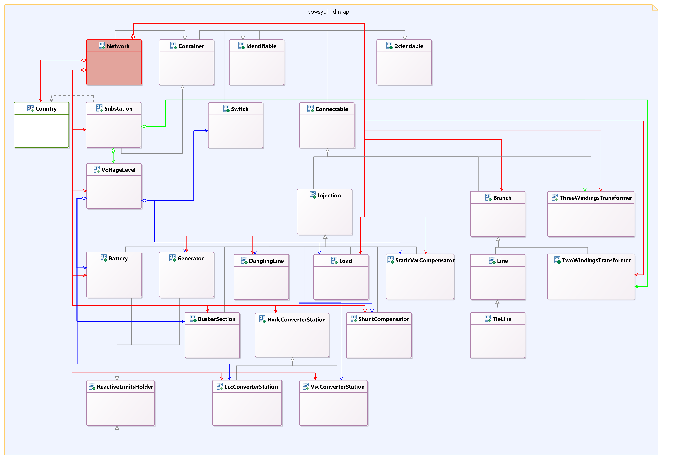
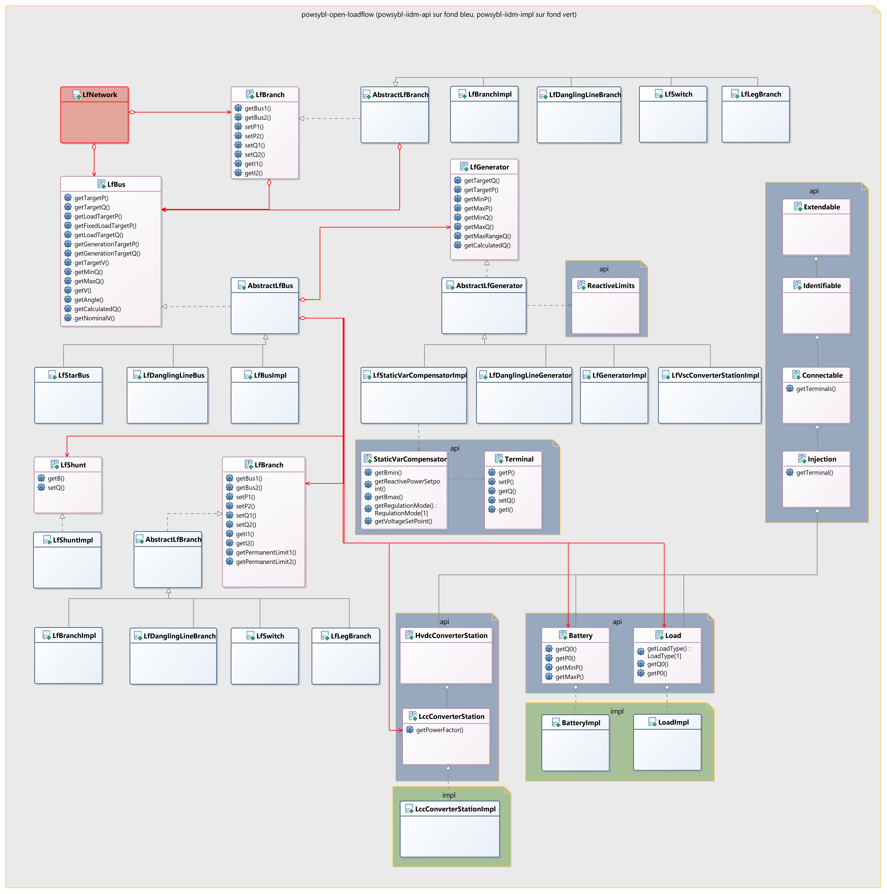
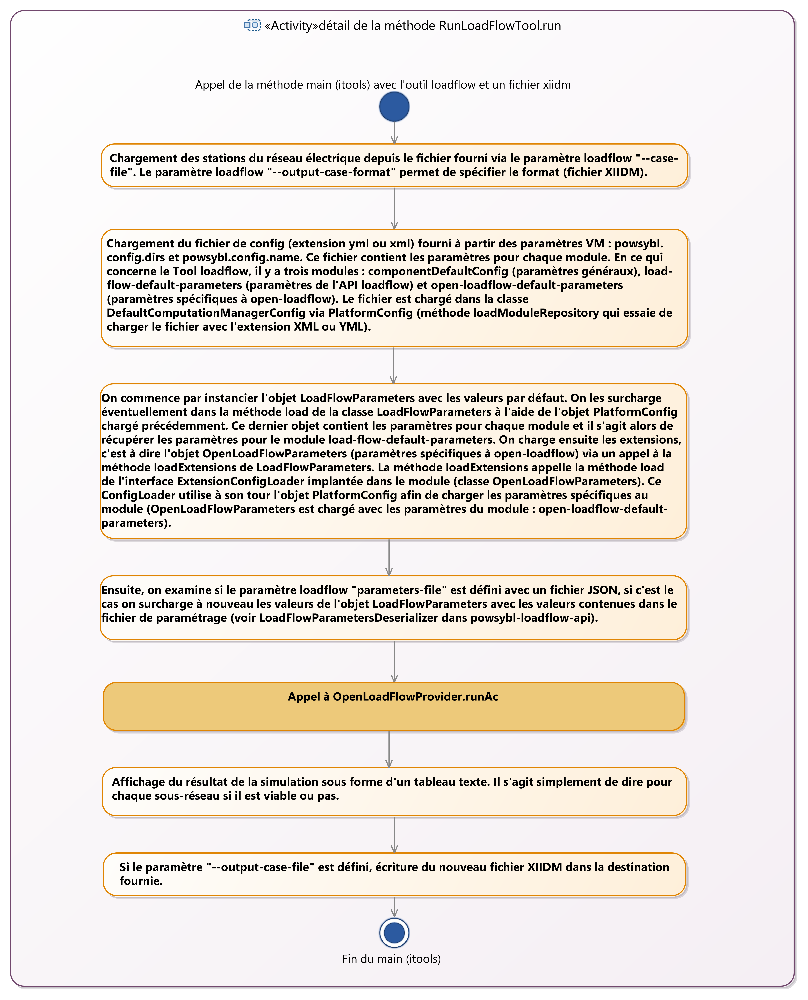
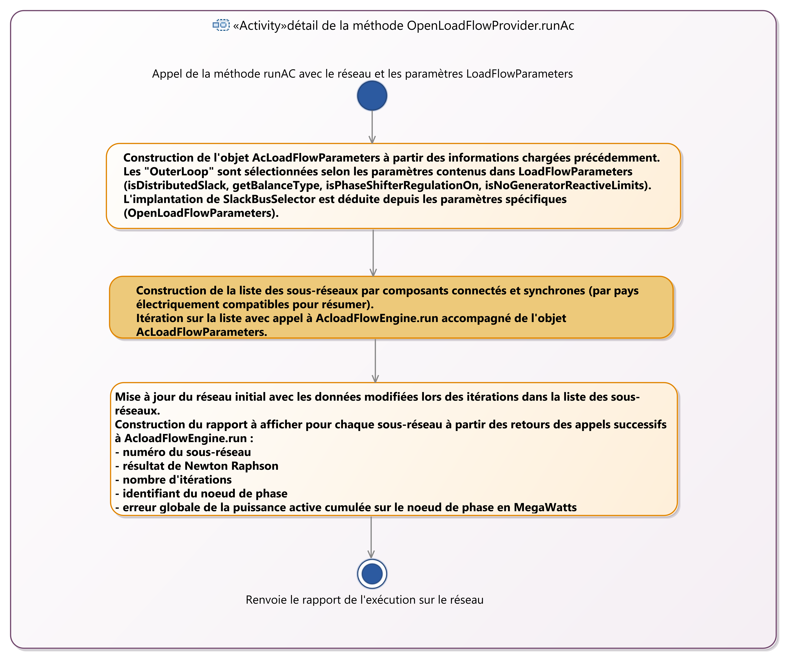
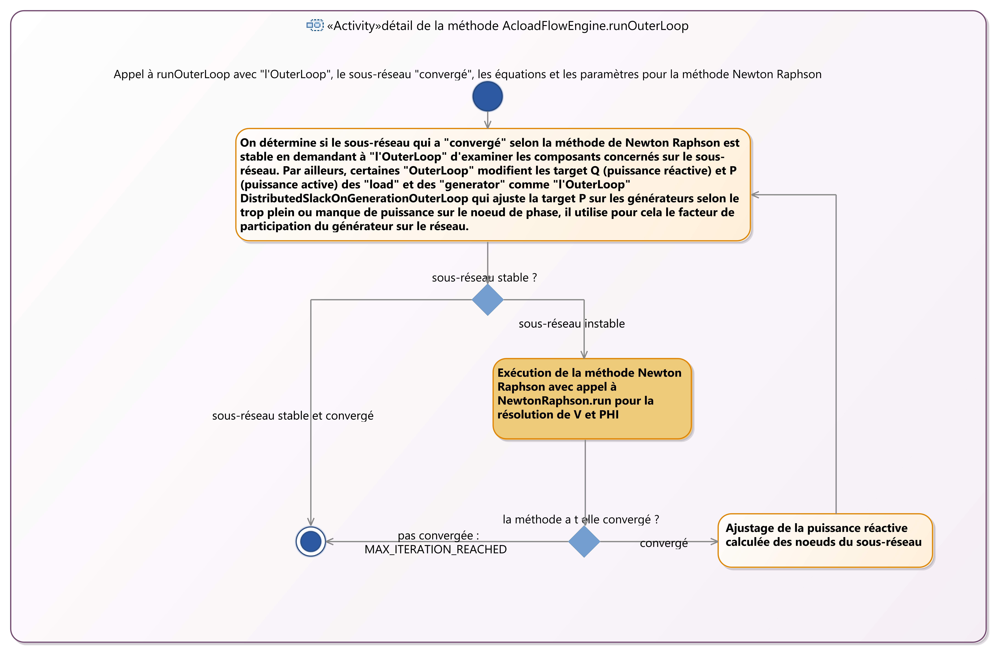
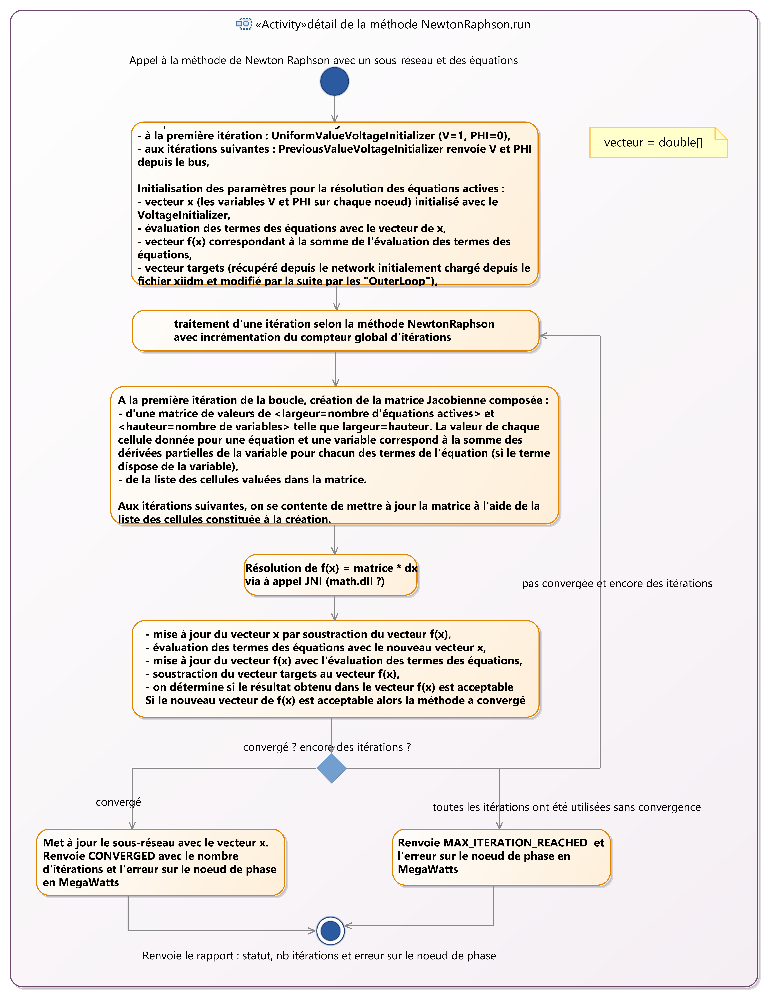

# Open Load Flow : functional specification with UML 

* TOC
{:toc}

## Purpose
Give a summary view about **Open Load Flow** and its integration with **powsybl-tools**.

## Bibliography
[Web page of Thierry Van Cutsem](https://people.montefiore.uliege.be/vct/courses) :
- [Introduction to electric power and energy systems](https://people.montefiore.uliege.be/vct/elec0014/elec0014.pdf)
- [Le calcul de repartition de charge (ou load flow)](https://people.montefiore.uliege.be/vct/elec0029/lf.pdf)

[Grid model](https://www.powsybl.org/pages/documentation/grid/model/)

## Classes involved when running loadflow with itools

| Maven&nbsp;dependency&nbsp;&nbsp;&nbsp;&nbsp;&nbsp;&nbsp;&nbsp;&nbsp;&nbsp;&nbsp;&nbsp;&nbsp;&nbsp;&nbsp; | Usage |
| -------------------------- | - |
| powsybl-tools              | provide a main method to run a tool (this current documentation is about **loadflow** tool) |
| powsybl-computation        | load all **module** configuration from config file into ***PlatformConfig*** object. User can specify config file with these two VM parameters : **powsybl.config.dirs** and **powsybl.config.name** |
| powsybl-loadflow-api       | this dependency provide the implementation of ***Tool*** interface : ***RunLoadFlowTool***. ***RunLoadFlowTool*** proceed in initialization before running the loadflow simulation on a network. First, load the network from file given with parameter **--case-file**. Second, init ***LoadFlowParameters*** with ***PlatformConfig*** previously loaded (module **load-flow-default-parameters**). Third, load extensions of ***LoadFlowParameters*** : in case of running loadflow, it uses ***ExtensionConfigLoader*** implementation in ***OpenLoadFlowParameters*** (module **open-loadflow-default-parameters**) |
| powsybl-iidm-converter-api | used to load ***Network*** object from **xiidm** file (xml format) |
| powsybl-open-loadflow      | this dependency is the one we discuss about in this documentation. Network simulation is run in this dependency. It builds an equation system before calling **Newton-Raphson** with a **Jacobian Matrix**. It adjusts network parameters in **outer loop** and run again Newton-Raphson until getting minimal **iteration** count and lower **mismatch**. At the end, it returns **CONVERGED** if equation system can be solved with a minimal ending mismatch on **slacked bus**.|

{: width="100%" style="margin-top: 2rem;" .center-image}

## Network modelisation in powsybl-iidm-api
This is the **Network** object from **powsybl-iidm-api** dependency loaded by **Importer** in **powsybl-iidm-xml-converter** dependency.
{: width="100%" style="margin-top: 2rem;" .center-image}

## Sub-network modelisation in powsybl-open-loadflow
The list of **LfNetwork** objects is build from **Network** Object in **LfNetworkLoaderImpl** from **powsybl-open-loadflow** dependency.
{: width="100%" style="margin-top: 2rem;" .center-image}

## Activities diagrams about powsybl-open-loadflow internal process
### 1. RunLoadFlowTool.run (Tool interface implementation)
{: width="100%" style="margin-top: 2rem;" .center-image}

### 2. OpenLoadFlowProvider.runAc (run on AC Network)
{: width="100%" style="margin-top: 2rem;" .center-image}

### 3. AcloadFlowEngine.run (internal openloadflow engine)
{: width="100%" style="margin-top: 2rem;" .center-image}

### 4. AcloadFlowEngine.runOuterLoop (detail about OuterLoop usage)
{: width="100%" style="margin-top: 2rem;" .center-image}

### 5. NewtonRaphson.run (NewtonRaphson implementation)
{: width="100%" style="margin-top: 2rem;" .center-image}

## Details about all OuterLoop implementations
### PhaseControlOuterLoop

### ReactiveLimitsOuterLoop

### DistributedSlackOnGenerationOuterLoop

### DistributedSlackOnLoadOuterLoop

