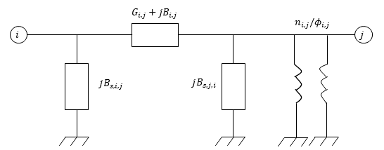

# OpenLoadFlow

PowSyBl OpenLoadFlow is an open-source power flow implementation in Java provided by PowSyBl. The source code is hosted on [GitHub](https://github.com/powsybl/powsybl-open-loadflow). 

* TOC
{:toc}

## Network model in OpenLoadFlow

The model used to perform sensitivity analysis is a classic model for load flow simulations.
The network is represented by a graph whose nodes are the network buses and edges are the branch lines or transformers.
The PI-model is used for branches and transformers.

### PI-model for branches and transformers

In OpenLoadFlow, Pi-model is used for branches and transformers.
That is, each branch or transformer is represented with the following electrical scheme.

TO DO : convert using inkscape.
{: width="500" .center-image}


### AC flows model

TO DO

### DC flows model

The DC flows model make several asumptions to build a model where the active power flowing throught a line depends linearly from the voltage angles at its ends.
In this model, reactive power flows and active losses are neglected.
Following asumptions are made:
- The voltage magnitude is equal to 1 per unit at each bus,
- The conductance \\(G_{i,j}\\) of each line \\((i,j)\\) is neglected, only the susceptance \\(B_{i,j}\\) is considered,
- The voltage angle difference between two adjacent buses is small.

Therefore, the power flowing from bus \\(i\\) to bus \\(j\\) is given by the linear expression:

$$ P_{i,j} = \frac{\theta_i-\theta_j+\phi_{i,j}}{X_{i,j}} $$

Where \\(X_{i,j}\\) is the rectance of the line \\((i,j)\\), and \\(\theta_i\\) the voltage angle at bus \\(i\\).

## Sensitivity analysis with DC flows model

With OpenLoadFlow it is possible to perform several types of sensitivity analysis listed below.

### Injection and phase shifting sensitivity

This type of sensitivity measures how the active flow on several given lines will be impacted when the injection is increased
by one MW on a given bus or when the phase shifting angle of one phase-shifting transformer is increased by one degree.

To do this, the first step is to build the grid constraints linear system.

The variable of the system are the voltage angles \\(\theta\\) (one for each bus).
The constraints of the system are the balancing of power at each bus, except for the slack bus.
One additional constraint states that the voltage angle is null at the slack bus.
Therefore the linear system is composed of \\(N\\) variables and \\(N\\) constraints, where \\(N\\) is the number of buses in the network:

$$ A\theta = b$$

The vector \\(b\\) of right-hand sides is linearly computed from the given injections and phase-shifting angles.

Second step consists in decomposing the square matrix \\(A\\) using the LU matrices decomposition:
$$ A = LU $$
Whence matrices \\(L\\) and \\(U\\) are obtained, it is quite easy to solve the grid constraints linear system.

The solution of this system gives the voltage angles corresponding to injections at each bus (minus the slack bus).

From those angles it is easy to compute the power flow on a given line using the previous formula. 

To get the sensitivity from injection in a given bus to a given line,
OpenLF computes the right-hand side \\(b\\) corresponding to an injection of 1 MW at this bus and 0 MW elsewhere.
Solving the system with matrices \\(L\\) and \\(U\\), vector \\(\theta\\) is obtained and is used to retrieve the power flow in the line.

To get the sensitivity from phase-shifting angle in a given bus to a given line,
OpenLF computes the right-hand side \\(b\\) corresponding to an increase of one degree for the phase-shifting angle at this bus and 0 elsewhere.
Solving the system with matrices \\(L\\) and \\(U\\), vector \\(\theta\\) is obtained and is used to retrieve the power flow in the line.

## Configuration


### Specific parameters

**lowImpedanceBranchMode**  
The `lowImpedanceBranchMode` property is an optional property that defines how to deal with low impedance lines (when $$Z$$ is less than the $$10^{-8}$$ per-unit threshold).
Possible values are:
- Use `REPLACE_BY_ZERO_IMPEDANCE_LINE` if you want to consider a low impedance line has $$R$$ and $$X$$ equal to zero.
- Use `REPLACE_BY_MIN_IMPEDANCE_LINE` if you want to consider a low impedance line with a small value equal to the previously given threshold.

**throwsExceptionInCaseOfSlackDistributionFailure**  
The `throwsExceptionInCaseOfSlackDistributionFailure` is an optional property that defines if an exception has to be thrown in case of slack distribution failure.
This could happen in small synchronous component without enough generators or loads to balance the mismatch.
In that case, the remaining active power mismatch remains on the selected slack bus.

**voltageRemoteControl**  
The `voltageRemoteControl` property is an optional property that defines if the remote control for voltage controllers has to be modeled.
The default value is `false`.

**slackBusSelectorType**  
The `slackBusSelectorType` property is an optional property that defines how to select the slack bus. The three options are available through the configuration file:
- `First` if you want to choose the first bus of all the network buses, identified by the [slack terminal extension]().
- `Name` if you want to choose a specific bus as the slack bus. In that case, the other `nameSlackBusSelectorBusId` property has to be filled.
- `MostMeshed` if you want to choose the most meshed bus as the slack bus. This option is required for computation with several synchronous component.

Note that if you want to choose the slack bus that is defined inside the network with a slackTerminal extension, you have to use the `LoadflowParameters`

**nameSlackBusSelectorBusId**  
The `nameSlackBusSelectorBusId` property is a required property if you choose `Name` for property `slackBusSelectorType`.
It defines the bus chosen for slack distribution by its ID.

See below an extract of a config file that could help:

```yaml
open-loadflow-default-parameters:
  lowImpedanceBranchMode: REPLACE_BY_ZERO_IMPEDANCE_LINE
  distributedSlack: true
  throwsExceptionInCaseOfSlackDistributionFailure: false
  voltageRemoteControl: false
  slackBusSelectorType: Name
  nameSlackBusSelectorBusId: Bus3_0
```

At the moment, overriding the parameters by a JSON file is not supported by OpenLoadFlow.
