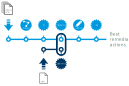

# Capacity calculation for RSC

This user story concerns Regional Security Coordinators (RSCs). An efficient and safe management of the European electricity system requires coordination at regional level. 
This is the role of RSCs, whose objectives are the coordinated security of the electricity system, the integration of large-scale renewable energy generation 
and the development of the European electricity market. They perform five core services for TSOs:

- Coordinated security analysis
- Outage planning coordination
- Coordinated capacity allocation
- Short-term and very short-term adequacy forecast
- Individual and common grid modeling and data set delivery


We are going to explain how to perform a coordinated capacity computation using PowSyBl and some specific developments. 
We want to ensure that flows across borders respect given maximum admissible values, while ensuring electricity security of supply. 
If some overloads are reported, a remedial actions optimization is called to find the cheapest solution to solve the constraints. 
Remedial actions can be either changing the tap of a PST (it modifies the impedance of the network and so the load-flows) or doing generator redispatching.

## Workflow

The first input data of this process is the network model, coming from UCTE or CIM-CGMES European exchange formats. 
We also need an object to define the security domain of the network, built from a CRAC file (**C**ontingency list, **R**emedial **A**ctions and additional **C**onstraints): 
it contains a contingencies list, the constraints to monitor and the available remedial actions to get rid of the constraints.   

In this process, we also need two computation engines:
- A loadflow computation is launched before and after each contingency to identify overloads.
- A sensitivity analysis: for each border, a sensitivity analysis determines the impact on the flow of a small variation of the PST angle, and that for all PSTs, and determines the impact on the flow of a small variation of the generation, and that for all generators.

A cost function is built from the previous results of the sensitivity analysis. It is then sent to a solver to find the remedial actions avoiding constraints at a minimal cost.

A security analysis is performed at the end of the process to validate the set of remedial actions found by the optimization.

All PowSyBl features used in this workflow are described below with some implementation examples.

{: width="70%" .center-image}

## Identification of the power system blocks

This user story involves several features from the PowSyBl framework and some other features that are specific:

<p style="text-align:center">
  
</p>
The studied network comes from a set of TSOs' networks. The TSOs' networks can be provided in a common TSO exchange format such as UCTE or CIM-CGMES formats. 
The following lines of code come format from [powsybl-tutorials](https://github.com/powsybl/powsybl-tutorials/tree/main/cgmes) and illustrate this functionality.

```java
File fileBe = new File("/path/to/file/MicroGridTestConfiguration_T4_BE_BB_Complete_v2.zip");
File fileNl = new File("/path/to/file/MicroGridTestConfiguration_T4_NL_BB_Complete_v2.zip");
```

<br />

<p style="text-align:center">
  
</p>
Each input file is imported and transformed to an in-memory object representing the network.

```java
Network networkBe = Importers.loadNetwork(fileBe.toString());
Network networkNl = Importers.loadNetwork(fileNl.toString());
```

<br />

<p style="text-align:center">
  
</p>
A topological merge of the TSOs' networks is done. The following lines of code come from [powsybl-tutorials](https://github.com/powsybl/powsybl-tutorials/tree/main/cgmes) and illustrate this functionality.

```java
networkBe.merge(networkNl);
```

<br />

<p style="text-align:center">
  
</p>
Then, flows are computed with a load flow simulator such as OpenLoadFlow or DynaFlow implementations.

A loadflow is run on the working variant of the in-memory network with a set of parameters. A computation manager `computationManager` (here defined locally) is used. The default parameters are listed [here](../configuration/parameters/LoadFlowParameters.md). Here angles are set to zero and voltages are set to one per unit. We also create a new variant to store the calculated flows. Note that a network variant is close to a state vector and gathers variables such as injections, productions, tap positions, states of buses, etc.

```java
LoadFlowParameters loadFlowParameters = new LoadFlowParameters().setVoltageInitMode(LoadFlowParameters.VoltageInitMode.DC_VALUES);
LoadFlowResult result = LoadFlow.run(network, loadFlowParameters);
```
<br />

<p style="text-align:center">
  
</p>
The sensitivity analysis module is dedicated to compute the linearized impact of small network variations on the state variables of some elements. The sensitivity computation is fully described [here](../sensitivity/index.md). In this user story, we use this module to compute all coefficients of the cost function. You can use OpenLoadFlow implementation for these computations.

<br />

<p style="text-align:center">
  
</p>
Remedial actions are read from the CRAC file and given to the optimizer which is a specific module. The best set of remedial actions is converted in actions understandable by PowSyBl. The CRAC file also provides the contingency list, which is also converted to an understandable object for PowSyBl called [Contingency](../contingencies/index.md).

<!--```java
public List<Contingency> getContingencies(Network network) {
      // Code here how you want to fill/map the list of contingencies.
}
```-->

<br />

<p style="text-align:center">
  
</p>
The final set of remedial actions is validated through a security analysis. A security analysis needs an input variant, a set of parameters as a `securityAnalysisParameters` object and a set of contingencies through a list.

```java

```

## External features are:

<p style="text-align:center">
  
</p>
The cost function builder is in fact a big toolbox using some power system blocks from the PowSyBl framework. For more details about this builder, please refer to [FARAO website](https://farao-community.github.io/). The Google OR-Tools open source library is used to perform the optimization: please visit this [page for more details](https://developers.google.com/optimization/).

