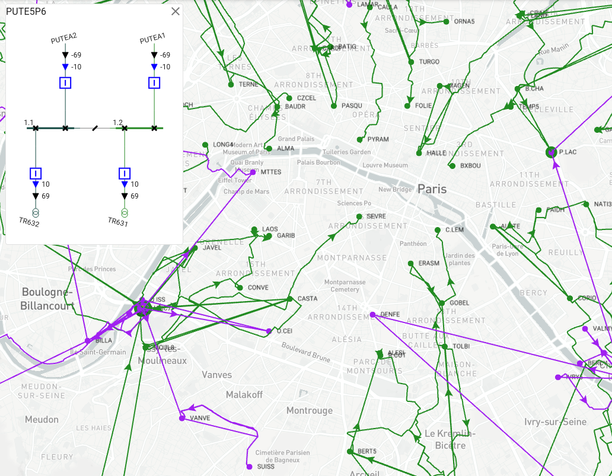

# Overview

PowSyBl (<b>Pow</b>er <b>Sy</b>stem <b>Bl</b>ocks) is an open source framework written in Java,
dedicated to electrical grid modelling and simulation, licensed under the [Mozilla Public License version 2.0](./license). 
It is part of [LF Energy](https://www.lfenergy.org/), an open source foundation focused on the power systems sector, hosted within The Linux Foundation. 

The power system blocks may be used through scripts for a quick implementation (or prototyping), but also be assembled to build state of the art applications.
Indeed, one major aim of the project is to make it easy to write complex software for power 
system simulation and analysis. For example, using PowSyBl one can create applications able to:
- handle a variety of formats, such as CGMES for European data exchanges
- perform power flow simulations and security analyses on the network
- perform dynamic simulations on the network
- create visual representations of the network
- etc.

Another key characteristic of PowSyBl is its modular design, at the core of the open source approach.
It enables developers to extend or customize its features by providing their own plugins.

Check the [Getting started](../documentation/user) and [Configuration](../documentation/user/configuration) pages to learn how to install and configure PowSyBl.

# Features
PowSyBl provides a complete [internal grid model](../documentation/grid/formats/xiidm.md) 
with substations, voltage levels, AC and DC lines, two and three windings transformers, batteries,
generators, loads, shunt and static VAR compensators, etc. 

{: width="50%" .center-image}

For [security analyses](../documentation/simulation/securityanalysis/index.md), it offers the possibility to define contingencies on the network.
The grid model can also be enhanced with [extensions]() that complete the equipments modeling 
(dynamic profile, short-circuit profile, monitoring, etc.). 

PowSyBl also provides [importers and exporters](../documentation/index.html#grid-formats) 
for several common pan-european exchange formats (Entso-E CIM/CGMES, UCTE-DEF, etc.).

PowSyBl as a library provides several APIs for power systems’ simulation and analysis 
([power flow computation](../documentation/simulation/powerflow/index.md), 
[security analysis](../documentation/simulation/securityanalysis/index.md), 
[sensitivity analysis](../documentation/simulation/sensitivity/index.md),
[time domain simulation](../documentation/simulation/timedomain/index.md), etc.). 
These simulations can run either on a personal computer or on a server, but they can 
also run on a supercomputer like in the iTesla project with the Curie supercomputer. 
The separation of the simulation API and the implementations allows developers to 
provide their own implementations if necessary, which makes the framework very flexible.

PowSyBl enables users to display [network graph diagrams and single-line diagrams](https://github.com/powsybl/powsybl-diagram#readme) of a network in a highly customizable way.

PowSyBl is also available as a [command line tool](../documentation/user/itools/index.md), for quick shot modelling and/or simulation.
PowSyBl scripts may be written and executed thanks to the [dedicated Domain Specific Language](../documentation/user/itools/run-script.md) code included in the project.

All the features of PowSyBl are exposed as [web services](../documentation/index.html#microservices), so as to make it easy to build web-based 
applications on top of the framework.

# Projects

{: width="30%" .center-image}

## Java libraries
The PowSyBl project contains of a set of Java libraries that cover all the abovementioned features:

- [Application File System](../documentation/developer/repositories/powsybl-afs.md): a library to handle study files.

- [Balances adjustments](../documentation/developer/repositories/powsybl-balances-adjustment.md): balances adjustment is a process that consists in acting on 
specified injections to ensure given balance on specific network areas.

- [Core](../documentation/developer/repositories/powsybl-core.md): provides the core features of the PowSyBl framework such as the grid modelling, 
the support of several data exchange format ([CGMES](../documentation/grid/formats/cim-cgmes.md), [UCTE](../documentation/grid/formats/ucte-def.md)...), computation APIs ([power flow](../documentation/simulation/powerflow), [security analysis](../documentation/simulation/securityanalysis), [sensitivity analysis](../documentation/simulation/sensitivity), [dynamic simulation](../documentation/simulation/timedomain), etc.).

- [Dynawo](../documentation/developer/repositories/powsybl-dynawo.md): a library based on the open source [Dynawo](https://github.com/dynawo/) software for time domain simulation.

- [High Performance Computing](../documentation/developer/repositories/powsybl-hpc.md): a library to facilitate high performance computing
with PowSyBl.

- [Open loadflow](../documentation/developer/repositories/powsybl-open-loadflow.md): an open source library for power flow simulations (load flows, security analysis, sensitivity analysis).
- 
- [Powsybl-diagram](../documentation/developer/repositories/powsybl-diagram.md): a library to display higlhy customizable diagrams of a network.

- Network Hypothesis: provides component to model network hypotheses.

- PowSyBl GSE (archived): a library to make it easier to 
write desktop applications based on PowSyBl. This repository is archived. The Grid Study Environment (GSE) project
aimed at helping developers to write desktop applications based on PowSyBl, through a JavaFX user interface.

All these repositories also contain the associated DSL when necessary, for a very simple use of PowSyBl through the command line and/or scripts.

## Microservices

The project also contains a set of microservices that expose PowSyBl's features:

- [Case server](../documentation/developer/repositories/powsybl-case.md): handles raw network data storage.

- [Network store server](../documentation/developer/repositories/powsybl-network-store.md): provides a persistent IIDM implementation, exposed as a web service.

- [Geographical data server](../documentation/developer/repositories/powsybl-geo-data.md): handles equipments locations.

- [Network conversion server](../documentation/developer/repositories/powsybl-network-conversion-server.md): 
this service can convert a network stored in a case server to an IIDM network 
stored in the network store server.

- [CGMES geographical data import server](../documentation/developer/repositories/powsybl-cgmes-gl.md): 
this service can take a CGMES network containing a Geographical Layout profile from a case server 
and upload its content to the geographical data server.

- [Single line diagram server](../documentation/developer/repositories/powsybl-single-line-diagram-server.md): 
this service can generate a voltage level single line diagram (in SVG format) for a 
given voltage level in an IIDM network, from a network store server.

- [Network map server](../documentation/developer/repositories/powsybl-network-map-server.md):
this service is used to extract network data from a network store server 
and reshape it to feed a UI network map component.

{: width="50%" .center-image}

<!--
Loadflow Server

The load flow server is able to run a load flow on a network from 
a network store server and update the state variables.

Network modification server

This is a high level network modification service. It can apply a list of predefined network modifications (switch position, setpoint, tap position, etc) or execute a Groovy script when a more generic and powerful way to modify the network is needed.

### Study server

This is the unique entry point for the front end. This service is responsible for study management (creation, opening, removal) and also exposes all operations from other services needed for the front end.

### Study front-end

Study tool front end developped in React.js.

</li-->

## C++ libraries

- [IIDM for C++](../documentation/developer/repositories/powsybl-iidm4cpp.md): a C++ implementation of IIDM, to enable C++ developers to use PowSyBl. 

- [Math native](../documentation/developer/repositories/powsybl-math-native.md): a C++ library for sparse matrices. Used in open loadflow for example.

## Tutorials
PowSyBl provides a repository containing all the necessary code to go through its tutorials: 
[PowSyBl tutorials](https://github.com/powsybl/powsybl-tutorials).
 
## Incubator

The [PowSyBl incubator](https://github.com/powsybl/powsybl-incubator) repository contains
all the experimental code corresponding to ongoing work that is not stabilized yet.

## Developer tools

The [Powsybl dev tools](https://github.com/powsybl/powsybl-dev-tools) repository contains tools to be used for debug purposes.
